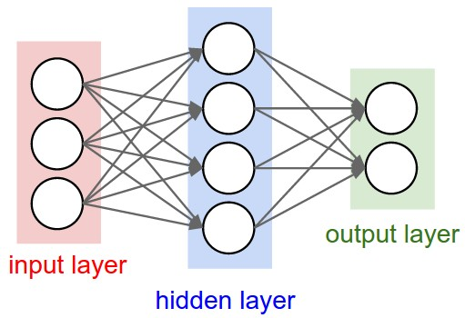

## 목차
- [AND Perceptron](#and-perceptron)
  - [Code](#code)
  - [Code 분석](#code-분석)
    - [Perceptron Class 분석](#perceptron-class-분석)
    - [init생성자-초기화](#init생성자-초기화)
    - [activation method - 활성화](#activation-method---활성화)
    - [predict-가중치합+바이어스](#predict-가중치합바이어스)
    - [train: 실제 훈련](#train-실제-훈련)
      - [오차 계산](#오차-계산)
      - [오차 발생횟수](#오차-발생횟수)
  - [결과 분석](#결과-분석)
    - [오차발생율](#오차발생율)
- [OR Perceptron](#or-perceptron)
  - [Code](#code-1)
  - [결과](#결과)
    - [오차발생율](#오차발생율-1)
  - [Q. AND Perceptron Vs OR Perceptron](#q-and-perceptron-vs-or-perceptron)
    - [Learning rate](#learning-rate)
    - [AND Gate의 훈련 초기](#and-gate의-훈련-초기)
    - [OR Gate의 훈련 초기](#or-gate의-훈련-초기)
      - [분석](#분석)
- [XOR Perecptron](#xor-perecptron)
  - [Code](#code-2)
  - [결과](#결과-1)
    - [오차발생율](#오차발생율-2)
  - [결과 분석](#결과-분석-1)
    - [단일 Perceptron의 한계](#단일-perceptron의-한계)
- [XOR Gate: 비선형 문제 해결방법](#xor-gate-비선형-문제-해결방법)
  - [MLP: Multi-Layer Perceptron](#mlp-multi-layer-perceptron)
    - [구조](#구조)
    - [1. Hidden Layer](#1-hidden-layer)
    - [2. 비선형 활성화 함수](#2-비선형-활성화-함수)
  - [해결](#해결)
    - [결과](#결과-2)
- [Learning Rate](#learning-rate-1)
  - [LR이 클 때 문제점](#lr이-클-때-문제점)
    - [발산](#발산)
  - [LR이 작을때 문제점](#lr이-작을때-문제점)
    - [추가할 것](#추가할-것)

# AND Perceptron

## Code

[1.AND Perceptron]()
[2.결정 시각화]()
[3.오류 시각화]()

## Code 분석

### Perceptron Class 분석

### init생성자-초기화
```python
  def __init__(self, input_size, lr=0.1, epochs=10):
    self.weights = np.zeros(input_size)
    self.bias = 0
    self.lr = lr
    self.epochs = epochs
    self.errors = []
```

- 입력 정의
  - self: class의 instance 자신
    - class 내부에 정의된 함수인 method의 첫 인자는 반드시 **self**여야 한다
  - input_size
    - 퍼셉트론이 처리할 입력의 개수
    - AND gate이므로 입력 2개
      - input_size = 2
  - lr: Learning Rate
    - 학습률을 의미
    - 훈련 중, 가중치를 얼마나 업데이트할지의 비율
      - lr값을 바탕으로 가중치와 바이어스를 업데이트함
    - 값이 크면 --> 불안정
    - 값이 작으면 --> 학습속도 느려짐
  - epochs: 훈련의 반복횟수

- 초기화
  - weights
    - {0,0}으로 초기화
    - Perceptron에서 바이어스를 0으로 초기화
    - learning rate = 0.1로 초기화
    - epochs 학습량을 10으로 초기화
    - errors[]
      - 빈 배열 정의
      - epoch마다 발생한 오류의 개수를 넣음

### activation method - 활성화
```python
  def activation(self, x):
    return np.where(x > 0, 1, 0)
```
- x가 0보다 크면 1, 아니면 0을 출력

### predict-가중치합+바이어스
> 활성화 함수의 입력 구하기

```python
  def predict (self, x):
    linear_output = np.dot(x, self.weights) + self.bias
    return self.activation(linear_output)
```
- np.dot
  - 벡터의 내적 수행
  - 입력 x와 가중치 내적을 수행
  - 여기서는
    - 입력: x1, x2
    - 가중치: w1, w2
    - x1*w1 + x2*w2
  - 결과는 가중치 합이 됨
- self.bias
  - 가중치합에 더할 바이어스
  - 이 결과가 activation함수로 들어감

### train: 실제 훈련
```python
  def train(self, x, y):
    for epoch in range(self.epochs):
      total_error = 0
      for xi, target in zip(x, y):
        prediction = self.predict(xi)
        update = self.lr * (target - prediction)
        self.weights += update * xi
        self.bias += update
        total_error += int(update != 0.0)
      self.errors.append(total_error)
      print(f"Epoch {epoch+1}/{self.epochs}, Errors: {total_error}")
```

- epoch
  - 정해진 훈련 횟수만큼 훈련 진행
  - 여기서는 epoch=10으로 정의했으니 10번 Train 진행
- x
  - 훈련에 사용될 입력값
  - AND의 경우
    - ([[0,0],[0,1],[1,0],[1,1]])
- y
  - 훈련에 사용될 정답
  - AND의 경우
  - ([0,0,0,1])
- xi
  - xi는 입력 배열 x에 대한 인덱스를 의미함
  - xi = 0이면 [0,0], 3이면 [1,1]임
- target
  - xi에 해당하는 정답 label임
  - xi = [0,0]이면 0
  - xi = [1,1]이면 1
  - 입력 벡터에 대한 실제 정답 출력
  - 훈련결과 실제 출력을 비교하여 가중치와 바이어스를 업데이트하는데 사용
- zip함수
<br>

#### 오차 계산
```python
 update = self.lr * (target - prediction)

 self.weights += update * xi
 self.bias += update
```
- 정답: target
- 실제 출력: prediction
- 두 값간 오차를 구해서 학습률(lr)을 곱해 가중치와 bias를 업데이트 함
- 가중치(weights)
  - 입력 벡터에 update를 곱해서 더함
- bias(바이어스)
  - 기존 바이어스에 더해주기만 함

#### 오차 발생횟수
```python
total_error += int(update != 0.0)
```
- 학습 횟수 한 번에 발생한 오차 개수를 구함
- 입력 벡터에 대한 출력의 오차 개수

## 결과 분석
 <br>

- 빨간색 점은 출력이 0인 point
- 파란색 점은 출력이 1인 point
- AND gate 동작과 정확하게 형성됨

### 오차발생율
<br>
- 6번째 학습부터 에러가 줄어듦

# OR Perceptron

## Code

[1.OR Perceptron]()
[2.결정 시각화]()
[3.오류 시각화]()

## 결과
 <br>

- 선형적으로 OR gate가 구현된 것을 확인할 수 있다

### 오차발생율
 <br>


## Q. AND Perceptron Vs OR Perceptron
> 왜 OR가 학습속도가 더 빠를까?

### Learning rate

### AND Gate의 훈련 초기
 <br>


### OR Gate의 훈련 초기
<br>

#### 분석
- AND gate는 마지막 입력벡터부터 오차가 발생해 업데이트 시작
- OR gate는 첫 입력벡터부터 지속적으로 오차가 발생해 업데이트 시작
- OR gate가 초기부터 더 많은 에러가 발생하여 업데이트 속도가 더 빠르다
- 때문에 AND gate보다 OR gate가 Error가 발생하지 않는 Epoch이 더 적다


# XOR Perecptron

## Code

[1.XOR Perceptron]()
[2.결정 시각화]()
[3.오류 시각화]()

## 결과
<br>
- 선형으로 구분할 수 없음
- XOR을 만족하는 가중치와 바이어스를 구할 수 없다
- **선형으로 분리불가능**

### 오차발생율
<br>

## 결과 분석
> 왜 이러한 결과가 나올까?

### 단일 Perceptron의 한계
- Perceptron은 선형 분류기임
- 입력공간에 대해 하나의 직선으로 데이터를 두개의 class로 나누는 것 밖에 할 수 없음
  - ```w1​x1​+w2​x2​+bias```
    - 학습 모델이 1차 방정식
    - 기울기 선형(직선)
- 활성화 함수가 계단함수
  - 활성화 함수가 0아니면 1로 출력함
  - 결과를 2개의 case로만 구분함(이진 분류)

- 근데 XOR는?
  - 직선으로만 Class를 구분할 수 없음
  - 분류를 하기위해 곡선이나 다른 방안이 필요함

# XOR Gate: 비선형 문제 해결방법

## MLP: Multi-Layer Perceptron
> MLP가 SLP의 비선형 문제를 어떻게 해결가능한가
<br>

### 구조
- Input Layer
- Hidden Layer
- Output Layer

### 1. Hidden Layer
- Hidden Layer
  - 기존에 선형적인 모델에 대해 복잡한 패턴을 학습할 수 있게 만듦
    - --> 선형패턴에서 비선형 패턴을 학습가능하게 만들어줌
- How?
  - Hidden Layer에서 Weight와 Activation Function을 적용해줌
    - 기존에는 출력층에서만 적용함
  - 단일 퍼셉트론은 입력에 대해 선형 처리만 가능했음
  - Hidden Layer에서 입력 데이터들을 비선형적으로 변환해줌
    - Hidden Layer의 노드에서 비선형 활성화함수를 거치기 때문

### 2. 비선형 활성화 함수
> 선형결합: ```w1​x1​+w2​x2​+bias```
- 비교) 단일 Perceptron
  - 단일 Perceptron은 활성화 함수로 받는 가중합이 선형결합의 결과임
  - 마지막 활성화 함수에 들어오는 입력이 선형성을 가짐
  - 비선형 문제를 해결하지 못함
- MLP
  - Hidden layer의 각 Node에서 비선형 활성함수를 거침
  - 때문에 마지막 활성화 함수에 들어오는 입력이 비선형성을 가짐
  - 때문에 비선형 문제를 해결가능

## 해결
- NAND, OR 단일 퍼셉트론 생성(각각의 뉴런)
  - 나온 결과를 z1, z2라 할때
  - z1과 z2를 AND 뉴런에 입력으로 넣어줌
  - 나온 결과는 xor가 됨

### 결과
<br>

# Learning Rate

## LR이 클 때 문제점
### 발산
- 업데이트 폭이 너무 커져 적합한 가중치를 지나쳐버림
- Overshooting문제가 발생
- 계속 적정 가중치를 맴돎

## LR이 작을때 문제점
- 학습속도가 느려짐
  - 세밀도가 올라 정확한 가중치는 찾을수 있을지라도
  - 학습속도는 느려짐
- 가중치 변화량이 너무 적어 학습이 더이상 진행하지 않는것처럼 보임

Q. 역전파가 가중치와 바이어스를 업데이트하는 방법
- 그냥 Hidden Layer의 뉴런마다 단일 퍼셉트론으로 학습하고 하면 안되나
- 따로 학습 시키고 모델을 학습시키지말고 한번에 모델들을 학습시킬려고 사용하는 건가


### 추가할 것
- 역전파 쓰는 이유
- xor 쓸 때 에러율

