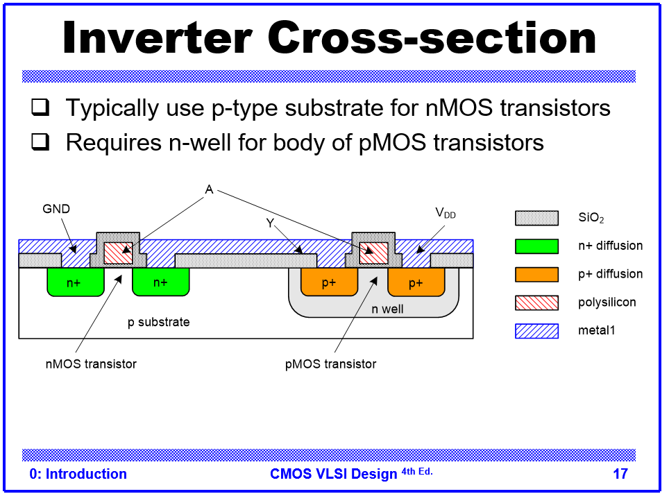
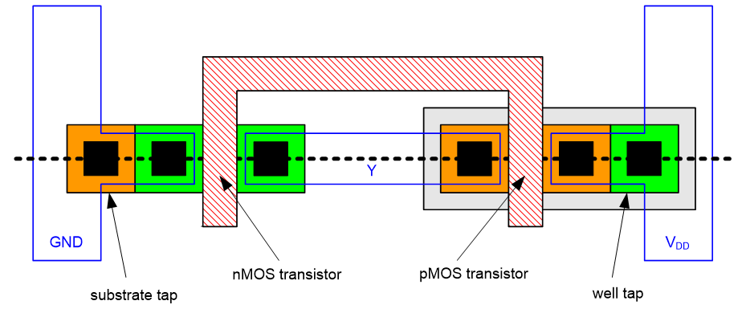
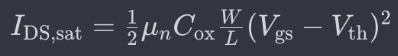

## 목차
- [CMOS VLSI](#cmos-vlsi)
  - [⭐Inverter Cross-section](#inverter-cross-section)
    - [self aligned 공정](#self-aligned-공정)
    - [gate-oxide의 두께](#gate-oxide의-두께)
  - [⭐Inverter Mask Set](#inverter-mask-set)
    - [Hole \& Electron Mobility](#hole--electron-mobility)
      - [심화) 전류(PMOS NMOS 속도차)조절](#심화-전류pmos-nmos-속도차조절)
  - [Layout](#layout)
    - [참고) 레이아웃 그릴 때](#참고-레이아웃-그릴-때)
    - [Contact](#contact)
      - [⭐Contact 여러 개 작게 Vs 단일로 크게](#contact-여러-개-작게-vs-단일로-크게)
      - [참고) contact layer](#참고-contact-layer)
      - [λ: 공정의 단위](#λ-공정의-단위)
      - [Design Rule Check](#design-rule-check)
  - [⭐Metal Layer](#metal-layer)
    - [Via](#via)
    - [Metal Layer 배선 - 물리적 배선(Cap 방지)](#metal-layer-배선---물리적-배선cap-방지)
    - [Metal Layer 배선 - 경유](#metal-layer-배선---경유)
  - [⭐stick diagram](#stick-diagram)
    - [그리는 방법](#그리는-방법)
    - [예시 1) Path가 없는 경우](#예시-1-path가-없는-경우)
      - [ex)](#ex)
      - [Path를 못 찾는 경우](#path를-못-찾는-경우)
      - [해결](#해결)
    - [예시 2) 입력이 추가된 경우](#예시-2-입력이-추가된-경우)
      - [방법 1](#방법-1)
      - [방법 2](#방법-2)
    - [예시 3) 입력신호를 다른 회로에서 거쳐서 받는 경우](#예시-3-입력신호를-다른-회로에서-거쳐서-받는-경우)
- [Custom Compiler](#custom-compiler)
  - [Inverter Simulation](#inverter-simulation)
    - [Problem](#problem)
      - [Why?](#why)
      - [Width 조절](#width-조절)
  - [시뮬레이션 사용법](#시뮬레이션-사용법)
    - [마커 기능](#마커-기능)

# CMOS VLSI
## ⭐Inverter Cross-section
 
> 위의 그림은 꼭 기억하자 
> single well 공정

### self aligned 공정
- silicide 도포된 부분은 공정에 영향없음
- diffusion이 implant될 부분을 제외하고 silicide를 깔아줌
  - 그러면 알아서 제외된 영역에 diffusion 영역이 생성됨

### gate-oxide의 두께
- 얇을수록 좋음
  - 전력효율이 좋음
  - 채널을 형성하기 위해 더 적은 전압이 필요
- 단, 수명이 짧아짐
  - oxide에 hot electron영향
  - tunneling 발생

> 참고) CMOS 구조
 

## ⭐Inverter Mask Set
 

### Hole & Electron Mobility
- Hole의 mobility보다 electron의 mobility가 2배 큼
- PMOS와 NMOS의 Width가 동일하다면
  - NMOS 스위칭 속도에 비해, PMOS 스위칭 속도가 느려짐
- 그래서 보통 PMOS의 Width를 NMOS에 비해 약 2배 크게 설정함
  - PMOS 쪽 전류량 증가

#### 심화) 전류(PMOS NMOS 속도차)조절
 
- 설계자는 W/L만 조절 가능
  - u: 모빌리티
  - Cox: 공정에서 관리
  - V: 설계자가 임의로 조정 불가능
- 항상 hole의 mobility가 electron보다 약 1/2 작은 것을 염두에 두고 설계해야 한다

## Layout

### 참고) 레이아웃 그릴 때
- 꼭 증착 순서로 안 그려도됨
- 설계자가 순서만 알고있음 됨

### Contact

#### ⭐Contact 여러 개 작게 Vs 단일로 크게
- ⭐Contact은 여러개 뚫는 것이 유리하다
  - Contact을 여러개 뚫으면 전압이 병렬로 들어감
    - 저항은 병렬로 연결될 수록 줄어듦
    - Contact의 저항 성분이 줄어듦
  - 그래서 단일의 큰 Contact보다 여러개의 작은 contact이 좋다

#### 참고) contact layer
- Layout 툴에서 contact은 그리면 보이지 않음

#### λ: 공정의 단위
- 람다(λ) : channel 길이의 1/2
  - 공정 단위의 1/2를 의미함
- 확장성이 좋음
  - 공정의 단위가 바뀌더라도 매개변수로 표현되기 때문에 다시 설계할 필요가 없음
    - 직접 공정단위로 입력하게 되면 새 공정단위 도입시, 레이아웃 설계를 다시 해야함

#### Design Rule Check
- 공정 기준에 맞추기위해 정해진 layout 조건
- 해당 조건을 지켜서 Layout을 그려야 공정에서 의도한대로 회로가 나올 수 있다

## ⭐Metal Layer

### Via
- metal끼리의 contact은 **via**라고 한다
- metal-1과 metal-2사이에 contact이 생기면 이를 via-1이라고 함
  - 낮은 metal layer의 숫자를 따라감

### Metal Layer 배선 - 물리적 배선(Cap 방지)
- Metal layer를 증착할 때, 순서대로 증착하지 않음
  - Metal-1위에 Metal-2, 3, 4순으로 증착하지않음
  - Metal이 너무 가까우면 **Parastic cap**이 생김
  - 따라서 보통 +2의 간격을 두고 증착함
    - Metal-1위에 Metal-3와 같이 증착

### Metal Layer 배선 - 경유
- Metal-1과 Metal-3를 연결한다고 가정하자
- 둘을 Direct로 연결할 수 없다
  - 제조 공정이 복잡해짐
  - 층간 절연 문제 발생
  - DRC 검증 복잡해짐
- 따라서 중간 Metal layer를 경유해서 가야한다
  - Metal-1과 Metal-3를 연결하려면, 중간에 Metal-2를 경유해서 연결해야함
 

## ⭐stick diagram

### 그리는 방법
1. path를 찾는다
   - NMOS, PMOS를 모두 만족하는 path

2. 모든 Tr를 **1회씩** 경유해야함
   - 하나의 노드를 중복해서 지나가는 path가 없어야한다

3. 노드 연결 시, 일반적으로 PMOS, NMOS사이에 metal line을 넣는다

4. Metal Line 연결 시, short나는 부분이 없게 연결해야한다 --> 겹치는 부분이 없어야 함
   - 구조적으로 겹칠 수 밖에 없으면 상위 layer의 metal을 연결해야함
   - 꼭 Metal-1만 사용한다고 좋은 건 아님
   - 어차피 Metal-1부터 9까지 증착해야함

5. ⭐출력부의 diffusion단자가 최소로 연결되게 한다
   - Parastic Cap을 줄이기 위함

### 예시 1) Path가 없는 경우
#### ex)
 

#### Path를 못 찾는 경우
 
- 이 경우에는 TR를 한번만 지나가는 Path를 찾을 수 없다

#### 해결
 
- 출력부의 diffusion 단자가 늘어나도 해당 그림처럼 배치한다
- 그러면 TR을 한번만 지나가는 path가 생긴다

### 예시 2) 입력이 추가된 경우
- 기존 회로에서 입력 E가 추가되어 OR되는 경우를 가정하자

#### 방법 1
- 예시 1처럼 새로 schematic을 그려서 stick diagram을 그릴 수 있음
- 이 경우, 회로 size나 cap 등의 최적화면에서 더 좋음
- 시간이 많으면 이런식으로 설계

#### 방법 2
- 기존 회로에서 E를 추가하는 방식으로 설계
 
- 기존 회로에서 E가 새로 추가된 모습이다

 
- 기존 stick diagram에서 E에 대한 부분을 추가해줌
- 다만, ㄱ부분과 X가 공통되는 부분이 없어 P+ diffusion이 2개 생성됨
- Cap이 증가하는 단점 존재
  - 시간이 없으면 이런 방법을 고려해보자

### 예시 3) 입력신호를 다른 회로에서 거쳐서 받는 경우
 
- 기존 회로도와 달리, 회로의 입력이
- 이전 회로를 거쳐나온 출력을 받는다
  - 하나의 schematic으로 그릴 수 없는 경우

 
- P+, N+ diffusion 선을 하나 더 그린다
- 안쪽 diffusion에는 좌측의 회로에 대해 그림
- 바깥쪽 diffusion에 대해서는 우측의 최종 회로에 대해서 그린다

# Custom Compiler

## Inverter Simulation
### Problem
 
- Inverter 시뮬레이션 결과
  - 정확히 0.5V에서 Transition이 일어나지 않음

#### Why?
 
- hole은 electron의 mobility에 비해 약 1/2배 작음
- PMOS와 NMOS의 Width가 동일한 경우
  - 스위칭 속도가 달라짐
  - PMOS의 스위칭 속도가 더 느리다
- 때문에 이에 맞게 PMOS의 Width를 조절해주어야 한다

#### Width 조절
- PMOS의 Width가 클수록 Inverter Transition 영역이 우측으로 이동한다
- 반대로 작을수록 PMOS 전류 driving 능력이 떨어져 좌측으로 transition 구간이 이동함

## 시뮬레이션 사용법
  
### 마커 기능
 
 
 
1. 시뮬레이션 창의 Vertical cursor버튼을 누른다
2. 그러면 시뮬레이션 창에 마커가 생긴다
3. 마커를 더블 클릭하면, 마커의 위치를 설정할 수 있다
   - 