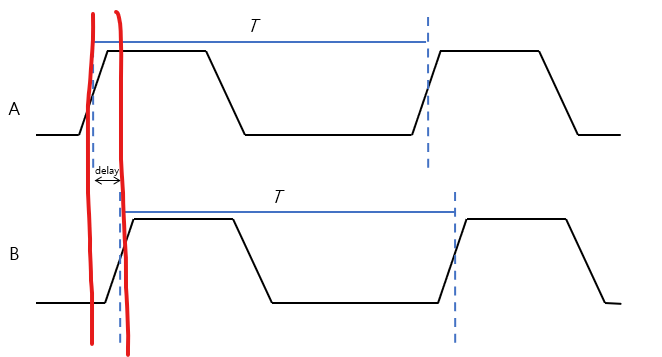

굉장히 중요함 너무나 중요함 무조건 알아야함⭐⭐⭐
---

# Setup Time / Hold Time

## Setup time 
- clk의 상승 엣지 이전에 입력 데이터가 충분히 유지되어야하는 시간

### Setup Time Violation

 

- 클럭의 상승 엣지 이전에 데이터가 안정되지 않고 흔들림

### 왜 발생하는가

- Clk period에 비해 Combinational Logic의 Delay가 큰 경우
- 예를 들어
  - Clock frequency: 100MHz (== 주기는 10ns)
  - F/F 사이 Combinational Logic 딜레이가 12ns
  - 다음 클럭 이전에 정상 값이 도착하지 않음
  - 혹은 변화 중에 값이 바뀜

### Critical Path
> 가장 큰 Propagation Delay가 발생하는 path

 

### 어떻게 해결할까

1. Clock Frequency를 낮춘다
   - 권장하지 않음
   - 클럭 주파수를 낮추면 성능이 저하됨
2. Pipelining⭐⭐⭐
   - Delay가 긴 Combinational Logic
   - 그 사이에 F/F을 삽입함
   - F/F 사이의 딜레이가 줄어듦

## Hold time
- Clk의 Edge 이후에 데이터가 안정되야하는 시간

### Hold Time Violation

 

- 클럭 엣지 이후에 데이터가 안정되지 않고 흔들림

### 왜 발생하는가
- F/F 사이의 딜레이가 없이 너무 빠른 경우
- 예를 들어, F/F 사이에 wire delay만 존재하는 경우
- 아니면 Clk skew에 의해 F/F간 들어오는 Clk간의 차이가 생겨서

- A가 이전 F/F, B가 이후 F/F이라 할 때
- 저 사이에 값이 흔들리면 Timing Violation이 발생한다

### 어떻게 해결하는가

- Buffer를 삽입하여 타이밍을 맞춰준다
- 의도적으로 F/F 사이에 딜레이를 걸어줌

# Clock Skew

 

- wire의 물리적 딜레이에 의해 clk간의 차이가 발생함
- Hold time violation에서 파형을 살펴보면됨

# Slack

## Slack이란

 

- 특정 path에서 데이터가 도착해야하는 시간(DAT)과 실제 그경로에 필요한 시간 사이 차이(DRT)
- Slack = DRT - DAT
- 예를 들어
  - setup time이 10ns인데
  - 실제 path는 12ns가 걸림
  - -2ns의 negative slack이 발생
  - 이거 문제임

$Setup Time Slack = Data Required Time (DRT) - Data Arrival Time (DAT)$

$Hold Time Slack = Data Arrival Time (DAT) - Data Required Time (Hold)$

Negative Slack을 없애는 것이 Back-end의 주 임무
---

# Recovery/ Removal time⭐
> 이 내용도 중요함 --> Critical Warning으로

 

- Setup / Hold의 개념과 유사
- Async Reset
  - clk 근처에서 reset값이 바뀌면 안됨
  - 변동이 생기면 F/F이 meta-stable에 빠질 수 있음
- Recovery time
  - Clk edge 앞 단에서 리셋값 변동이 생기면 안됨
  - Reset이 종료되고 값이 정상적으로 복원되는 시간
    - **Recovery time**
- Removal time
  - Clk edge 뒷 단에서 리셋값 변동이 생기면 안됨
  - Reset이 수행되어 값이 초기화되는 시간
    - **Removal time**