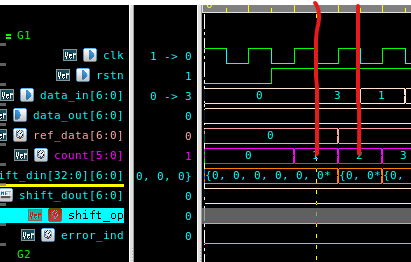
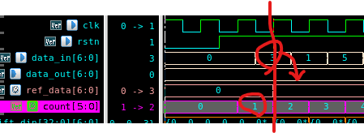
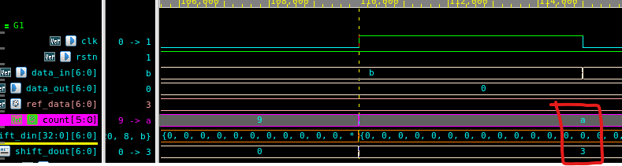
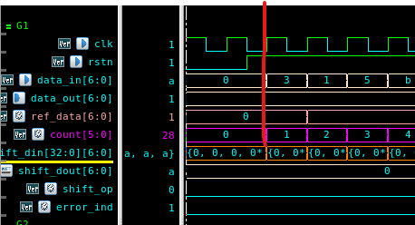
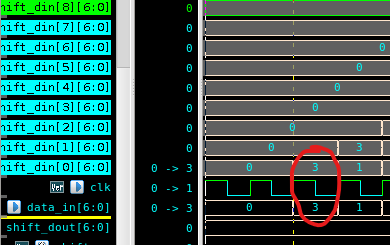
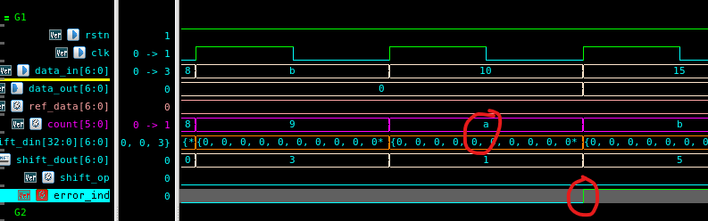
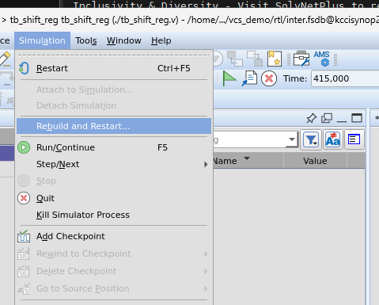
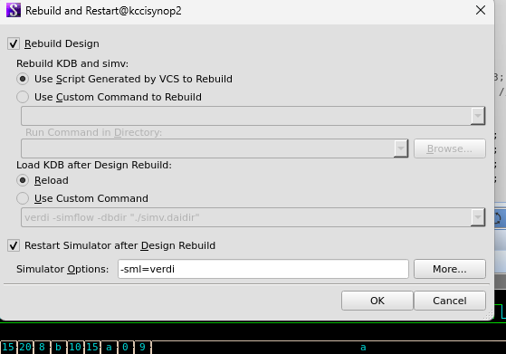

## 목차
- [TFV(Temporal Flow View)](#tfvtemporal-flow-view)
	- [스크립트 구성](#스크립트-구성)
	- [시뮬레이션 세팅 for AutoTracing](#시뮬레이션-세팅-for-autotracing)
	- [1. 시뮬레이션](#1-시뮬레이션)
	- [2. 값 추적](#2-값-추적)
	- [3. 회로 상에서 값 추적](#3-회로-상에서-값-추적)
	- [4. Unknown이 걸린 신호 모두 추적](#4-unknown이-걸린-신호-모두-추적)
	- [5. 신호 저장 후 복구하기](#5-신호-저장-후-복구하기)
		- [1) 신호 저장하기](#1-신호-저장하기)
		- [2) 신호 복구하기](#2-신호-복구하기)
- [Shift Register](#shift-register)
	- [Code 분석(DUT)](#code-분석dut)
		- [모듈 포트 정의](#모듈-포트-정의)
		- [shift\_din](#shift_din)
		- [shift\_dout](#shift_dout)
		- [ref\_data](#ref_data)
		- [data\_out](#data_out)
		- [shift\_op](#shift_op)
		- [error\_ind(erro indicator)](#error_inderro-indicator)
	- [정상 Case](#정상-case)
		- [정상 TB Code](#정상-tb-code)
		- [Waveform](#waveform)
	- [Error Case](#error-case)
		- [Error Case TB Code](#error-case-tb-code)
		- [Waveform](#waveform-1)
		- [error\_ind](#error_ind)
		- [shift\_op](#shift_op-1)
	- [결론⭐⭐⭐](#결론)
	- [⭐TB 작성 시 항상 Delta Delay를 염두에 두고 설계해야한다⭐](#tb-작성-시-항상-delta-delay를-염두에-두고-설계해야한다)
- [테스트 벤치 수정 - 시뮬레이션 재시작 방법](#테스트-벤치-수정---시뮬레이션-재시작-방법)


# TFV(Temporal Flow View)
> 에러(x)가 발생한 값을 추적할 때 유용하다

## 스크립트 구성
<br>

## 시뮬레이션 세팅 for AutoTracing
<br>

- Tool --> Preference에서 Cycle-based로 설정돼있어야 함

## 1. 시뮬레이션
<br>

## 2. 값 추적
<br>

<br>

- 에러가 난 신호를 Waveform에서 찍은 후, 소스코드에 단축키 x를 누르면 그 신호의 값이 나온다

## 3. 회로 상에서 값 추적

<br>

<br>

<br>

- x(unknown)이 발생한 신호를 Waveform에서 선택
- Unknow이 발생한 지점을 마킹
- 역삼각형 2개 아이콘을 클릭
- 그러면 x가 발생한 신호를 회로 상에서 추적할 수 있다

## 4. Unknown이 걸린 신호 모두 추적


- 3의 단계에서 Schematic 창에서 Tool --> All traced~를 선택
- 그러면 unknown이 발생한 회로와 연관된 모든 신호를 보여준다

## 5. 신호 저장 후 복구하기

### 1) 신호 저장하기

<br>

<br>

### 2) 신호 복구하기

<br>

<br>

<br>


# Shift Register

🌟🌟🌟
- TB의 입력은 delta delay가 없다
  - 값이 즉각 반영
- 내부 신호는 delta delay가 존재한다
  - 값이 delta delay후, 다음 클럭에 반영됨
[결론]
- 테스트벤치를 작성할 때는 항상 delta delay를 반영해서 넣어줘야함

shift_op 동작도 확인하기

## Code 분석(DUT)


### 모듈 포트 정의
```verilog
module shift_reg #(
	parameter WIDTH = 7
)(
	input clk,
	input rstn,

	input signed [WIDTH-1:0] data_in,
	output reg signed [WIDTH-1:0] data_out
);
```
- input
  - data_in
    - 7bit shift register 입력
- outptu
  - data_out
    - 7bit shift register 

### shift_din

```verilog
reg signed [WIDTH-1:0] shift_din [32:0];

integer i;

always @(posedge clk or negedge rstn)begin
	if (~rstn) begin
		for(i=32; i>=0; i = i-1) begin
			shift_din[i] <= 0;
		end
	end
	else begin
		for(i=32; i>=0; i = i-1) begin
			shift_din[i] <= shift_din[i-1];
		end
		shift_din[0] <= data_in;
	end
end
```

- 7bit 33개의 shift din 정의
- shift register로의 역할을 한다
- shift_din[i] << shift_din[i-1]
- Shift left 동작을 수행

### shift_dout

```verilog
wire [WIDTH-1:0] shift_dout;
//assign shift_dout = shift_din[8];
assign shift_dout = shift_din[8];

reg [5:0] count;

always @(posedge clk or negedge rstn) begin
	if(~rstn) begin
		count <= 4'b0;
	end
	else begin
		count <= count + 4'b1;
	end
end
```

- shift_dout은 Array 8번째 요소 shift_din을 조합논리로 출력
- 값이 바뀌면 즉시 반영해서 출력


### ref_data

```verilog
reg [WIDTH-1:0] ref_data;
always @(posedge clk or negedge rstn) begin
	if(~rstn) begin
		ref_data <= 4'b0;
	end
	else if(count == 6'd1) begin
		ref_data <= data_in;
	end
end
```

- counter가 1이되면 입력을 ref_data에 담는다
- 추후에 shift register의 동작과 오류 flag를 위해 사용된다

### data_out

```verilog
reg [WIDTH-1:0] data_out;

always @(posedge clk or negedge rstn) begin
	if(~rstn) begin
		data_out <= 4'b0;
	end
	else if(count == 6'd10) begin
		data_out <= shift_dout;
	end
end
```

- count가 10이되면 shift_dout(== shift_din[8])을 출력 data_out으로 내보냄
- data_out이 shift_din[8]을 내보냄
  - 0~8 --> 9번 카운트
  - ref_data가 counter가 1일 때 값을 받음
  - 1 + 9번 카운트 --> 10

### shift_op

```verilog
reg shift_op;

always @(posedge clk or negedge rstn) begin
	if(~rstn) begin
		shift_op <= 1'b0;
	end
	else if(count == 6'd10) begin
		if(shift_dout == ref_data) begin
			shift_op <= 1'b0;
		end
		else begin
			shift_op <= 1'b1;
		end
	end
end
```

- shift operation이 정상적으로 진행됐는지 판별하기 위한 flag
- 예를 들어, shift_din[0]의 값이 8클럭 이후에 shift_din[8]에 들어있는지 비교하여 shift register가 정상 동작했는지 확인

### error_ind(erro indicator)
```verilog
reg error_ind;

always @(posedge clk or negedge rstn) begin
	if(~rstn) begin
		error_ind <= 1'b0;
	end
	else if(count == 6'd10) begin
		if (shift_dout == 3) begin
			error_ind <= 1'b0;
		end
		else begin
			error_ind <= 1'b1;
		end
	end
end
```

- 정확한 타이밍에 shift_dout의 값이 나오는지 확인하기 위한 부분
- 추후 error case에서 자세히 설명예정
  - [Error Case](#error-case)

## 정상 Case

### 정상 TB Code

```verilog
initial begin
	clk <= 1'b1;
	rstn <=1'b0;
	#15 rstn <= 1'b1;
	#400 $finish;
end

initial begin
	data_in <= 7'd0;
	//#20 data_in <= 7'd3; //Abnormal
	#25 data_in <= 7'd3; //Normal
	#10 data_in <= 7'd1;
	#10 data_in <= 7'd5;
	#10 data_in <= 7'd11;
	#10 data_in <= 7'd15;
	#10 data_in <= 7'd21;
	#10 data_in <= 7'd32;
	#10 data_in <= 7'd8;
	#10 data_in <= 7'd11;
	#10 data_in <= 7'd16;
	#10 data_in <= 7'd21;
	#10 data_in <= 7'd10;
	#10 data_in <= 7'd0;
	#10 data_in <= 7'd9;
	#10 data_in <= 7'd10;
end
```

### Waveform

<br>

- data_in의 값이 clk의 falling edge에서 변화한다

<br>

- count가 1일때 그 때의 data_in이 ref 값으로 전달된다
- delta delay에 의해 count가 1이 되자마자 값이 전달되는 것이 아닌 다음 클럭에 값이 전달된다

<br>

- count가 1일 때의 shift_din(shift_din[0])이 count가 10일 때 shift_din[8](==shift_dout)로 잘 전달됨
  - 9 카운트 후에 정상적으로 값이 잘 도착함(1 --> 10: 9count)

## Error Case

### Error Case TB Code
```verilog
initial begin
	clk <= 1'b1;
	rstn <=1'b0;
	#15 rstn <= 1'b1;
	#400 $finish;
end

initial begin
	data_in <= 7'd0;
	#20 data_in <= 7'd3; //Abnormal
	//#25 data_in <= 7'd3; //Normal
	#10 data_in <= 7'd1;
	#10 data_in <= 7'd5;
	#10 data_in <= 7'd11;
	#10 data_in <= 7'd15;
	#10 data_in <= 7'd21;
	#10 data_in <= 7'd32;
	#10 data_in <= 7'd8;
	#10 data_in <= 7'd11;
	#10 data_in <= 7'd16;
	#10 data_in <= 7'd21;
	#10 data_in <= 7'd10;
	#10 data_in <= 7'd0;
	#10 data_in <= 7'd9;
	#10 data_in <= 7'd10;
end
```

### Waveform

<br>

- data_in이 clk의 rising edge와 동시에 값이 바뀜
- ⭐⭐⭐이게 핵심임
  - 원래라면 meta-stable로 에러가 남
  - RTL에선 그냥 반영
  - ⚠️RTL에서 Test Bench의 입력은 **delta delay가 없이** 값이 전달됨<br>

<br>

- 그래서 정상 case의 ref_data와 달리 clk이 올라감과 동시에 delta delay가 없이 값이 shift_din[0]로 전달된다

### error_ind

<br>

- data_in이 clk 타이밍에 맞추어 전달되는 것이 아닌 meta-stable상태에서 전달됨
- counter가 10일때 값 3이 출력되야함
  - 타이밍이 어긋나 3이 아닌 1이 출력됨
- error indicator가 올라감

### shift_op

- shift_op는 그대로 문제없이 0으로 정상 출력
- 타이밍 밀려도 shift는 정상적으로 진행됨 --> 9번의 카운트 후에 값이 전달은 잘됨
  - 하지만 실제 물리적으로는 meta stable이니 에러가 발생하겠죠잉?


## 결론⭐⭐⭐

- Test Bench의 입력
  - **Delta delay없이** clk edge와 동시에 값이 전달됨
  - 정상 동작이 아님
  - 회로가 정상이어도 TB에 의해 잘못된 회로로 판정될 수 있음❗
- 내부 신호
  - TB에 의해 만들어진 값이 아님
  - 트리거에 의해 회로 내부에서 생성된 신호
  - **Delta Delay**가 존재함

⭐TB 작성 시 항상 Delta Delay를 염두에 두고 설계해야한다⭐
---
> 값을 바꾸는 구간이 있다면 Clk의 falling edge에서 바꿔주자


# 테스트 벤치 수정 - 시뮬레이션 재시작 방법

<br>

<br>

- 해당 과정을 거치면 시뮬레이션을 종료하고 다시 시작할 필요 없음
- 수정된 TB가 반영되어 시뮬레이션을 돌릴 수 있다