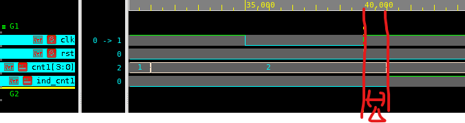
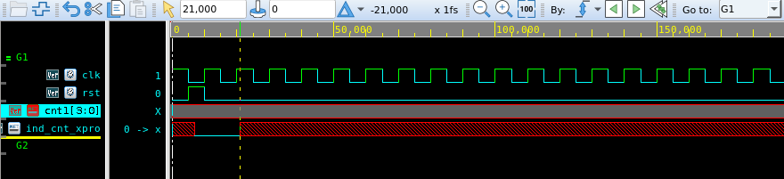

## 목차
- [Counter 실습](#counter-실습)
	- [RTL Compile 과정](#rtl-compile-과정)
	- [counter1.v - 정상 Case](#counter1v---정상-case)
	- [결과 이미지](#결과-이미지)
	- [counter1.v - Reset을 안 주는 경우(Error Case)](#counter1v---reset을-안-주는-경우error-case)
		- [결과 사진](#결과-사진)
- [Design Compiler](#design-compiler)
	- [counter.tcl 코드](#countertcl-코드)
	- [run\_counter.dc](#run_counterdc)
	- [Gate-level Simulation](#gate-level-simulation)
		- [run\_gate\_cnt1 - gate level 시뮬레이션](#run_gate_cnt1---gate-level-시뮬레이션)
		- [counter1\_0.v 결과](#counter1_0v-결과)
	- [⭐⭐⭐ Delta Delay](#-delta-delay)
	- [Q. Auto tracing하면 추적 안되는 이유](#q-auto-tracing하면-추적-안되는-이유)
		- [counter1\_xpro\_0.v 결과](#counter1_xpro_0v-결과)
- [추가 지식](#추가-지식)
- [Pre-layout / Post-layout](#pre-layout--post-layout)
	- [rpt 파일에서 slack](#rpt-파일에서-slack)
	- [Hold time violation](#hold-time-violation)


# Counter 실습

## RTL Compile 과정

> run_cnt
```tcl
vcs -full64 -kdb -debug_access+all+reverse -f cnt_filelist
./simv -verdi &
#nWave &
```

> cnt_filelist
```tcl
./counter1.v
./counter2.v
./counter3.v
./counter1_xpro.v
./tb_cnt.v

```

- ```source run_cnt```를 입력하면
  - verdi gui simulation이 실행된다

## counter1.v - 정상 Case

> DUT
```verilog
/*counter1.v*/
`timescale 1ns/10ps;

module counter1 (
 input clk, rst,
 output [3:0] cnt,
 output ind_cnt
);

reg [3:0] count;

assign cnt = count;

always @(posedge clk or posedge rst) begin
 if (rst) begin
	count <= 4'b0;
 end
 else begin
	count <= count + 4'b1;
 end
end

reg ind_cnt;

always @(posedge clk  or posedge rst) begin
	if(rst) begin
		ind_cnt <= 1'b0;
	end
	else if (count == 4'b0010) begin
		ind_cnt <= 1'b1;
	end
	else begin
		ind_cnt <= 1'b0;
	end
end

endmodule

```

- 0xF까지 세는 카운터
- ind_cnt는 counter가 2일 때마다 tick을 생성

> Testbench

```verilog
`timescale 1ns/10ps

module tb_cnt();

reg clk,rst;
wire [3:0] cnt1, cnt2, cnt3_1, cnt3_2;
wire ind_cnt1, ind_cnt1_xpro;

initial begin
 clk <= 1'b1;
 rst <= 1'b0;
 #5 rst <= 1'b1;
 #5 rst <= 1'b0;
 #400 $finish;
end

counter1 TEST1(clk, rst, cnt1, ind_cnt1);
counter2 TEST2(clk, rst, cnt2);
counter3 TEST3(clk, rst, cnt3_1, cnt3_2);
counter1_xpro TEST1_xpro (clk, rst, cnt1_xpro, ind_cnt1_xpro);

always #5 clk <= ~clk;

endmodule
```
- TestBench code는 모든 counter에 대해 동일하다


## 결과 이미지

 <br>

- 원하는대로 counter값이 2일 때마다 indicator(ind_cnt)가 tick을 발생한다

> xpro: xpropagation

## counter1.v - Reset을 안 주는 경우(Error Case)

> DUT

```verilog
/*counter1_xpro.v*/
`timescale 1ns/10ps;

module counter1_xpro (
 input clk, rst,
 output [3:0] cnt,
 output ind_cnt_xpro
);

reg [3:0] count;

assign cnt = count;

//always @(posedge clk or posedge rst) begin
always @(posedge clk) begin
 //if (rst) begin
//	count <= 4'b0;
 //end
 if (count == 4'd15)
	count <= 0;
 else
	count <= count + 4'b1;
end

reg ind_cnt_xpro;

always @(posedge clk or posedge rst) begin
	if(rst) begin
		ind_cnt_xpro <= 1'b0;
	end
	else if(count == 4'b0010) begin
		ind_cnt_xpro <= 1'b1;
	end
	else begin
		ind_cnt_xpro <= 1'b0;
	end
end

endmodule

```
- ⚠️Reset을 안 걸었준 것을 확인

### 결과 사진

<br>

- Reset을 걸지 않음
  - count의 초기값이 뭔지 정의가 안됨
  - default인 ```x```가 출력됨

# Design Compiler

## counter.tcl 코드

```tcl
#counter.tcl
#operation condition : BC / TC / WC
set min_cond "BC"
set max_cond "WC"
set used_vt  {"hvt" "svt" "lvt"}
set designName "counter1"
set revName     "counter1_0"
set outputName "${revName}"
set file_script  "counter.tcl"
set file_sdc_input "counter.sdc"
set file_hdl_list "counter.list"
source scripts/set_var.tcl
set file_script_bak [list $file_script $file_sdc_input]
source scripts/file_works.tcl
define_design_lib WORK -path $dir_out/work
source scripts/env.tcl
#source $file_analyze
source $file_hdl_list
#source scr/analyze_list
DATE_STAMP "start" $file_stamp
elaborate $designName
  source scripts/condition.tcl
  source $file_sdc_input
  set_svf $file_svf
  set_host_options -max_cores 6 
  #write_sdc $file_sdc_syn.0
  #echo "------------------------------" >> $file_check
  check_design >> ${file_check_design}.pre
  check_timing >> ${file_check_timing}.pre
compile_ultra -scan -gate_clock -no_autoungroup
DATE_STAMP "  end : synth of TOP" $file_stamp
source scripts/report.tcl
DATE_STAMP "end" $file_stamp

#exit
```

- designName
  - 설계한 RTL 코드의 이름
- revName
  - RTL코드를 바탕으로 만들어진 netlist 코드
- ```compile_ultra -scan -gate_clock -no_autoungroup```
  - 실제 합성을 위한 핵심 코드

## run_counter.dc
```tcl
dc_shell -f counter.tcl | tee run.log
```

- 해당 스크립트를 실행하면
  - .rpt
    - setup / hold time violation을 확인하는 파일
    - Area
  - counter1_0.v
    - netlist형태로 합성된 코드
- 가 생성된다

## Gate-level Simulation

- DC 결과로 나온 Netlist파일을 이용하여 gate-level simulation을 돌릴 수 있다
  - counter1_0.v(netlist file)

### run_gate_cnt1 - gate level 시뮬레이션
```tcl
vcs -full64 \
    -kdb \
    -debug_access+all \
    -v /pdk/GF22FDX_SC7P5T_116CPP_BASE_CSC20L_FDK_RELV02R80/verilog/GF22FDX_SC7P5T_116CPP_BASE_CSC20L.v \
    -v /pdk/GF22FDX_SC7P5T_116CPP_BASE_CSC20L_FDK_RELV02R80/verilog/prim.v \
    -f gate_cnt_filelist
./simv -verdi &
```

- /pdk에 들어있는 라이브러리를 불러옴
- 라이브러리를 바탕으로
  - Gate의 물리적 성질을 실제로 반영함
  - Gate delay등이 반영됨

### counter1_0.v 결과

<br>

- 겉보기엔 RTL Simulation과 동일하게 보임

⭐⭐⭐ Delta Delay
---
<br>

- Gate-level Simulation에선
  - Delta delay가 눈으로 보임
    - 실제 gate logic delay가 반영됨
  - RTL은 delta delay가 눈으로 안보임

Q. Auto tracing하면 추적 안되는 이유
---
<br>

- Auto Tracing을 하면 회로가 안나옴
- Why?
  - Counter 모듈 1개만 존재
  - x가 발생하는 원 신호가 너무나 명확함
  - 발생의 원인 회로 이런 것 없이 너무나 명확함
- 그래서 X에 대한 auto tracing시 회로가 안나옴
  - 사실 원인도 명확하고 회로 정보도 불충분함
  - 추적의 의미가 없음

### counter1_xpro_0.v 결과

> RTL sim 결과와 비교해보기


# 추가 지식

디버깅 과정
1. x가 발생한 경우, 어떤 부분부터 x가 발생하는지 추적해야함
2. 제일 먼저 x가 발생한 것을 찾음
3. 코드 상에서 x의 시작 신호를 확인함
   - 코드 에러 찾기
4. RTL Simulation을 다시 돌려서 확인함
5. 다시 합성함
   - 문제가 없으면
6. Gate-level Simulatoin을 실행함

> FPGA에서 돌면 ASIC에서 잘 돌을 확률 큼
> > FPGA의 라이브러리 후짐 및 CLK 속도 낮음

# Pre-layout / Post-layout
- pre-layout
  - gate logic delay만 반영함
  - 아직 P&R전
- post-layout
  - P&R 후
  - wire delay도 포함됨

## rpt 파일에서 slack
- 여기서 나오는 slack은 worst case를 뽑아서 보여줌

## Hold time violation
- hold time은 P&R까지 완료해서 wire delay까지 반영돼야 확인가능
  - F/F 사이의 wire delay까지 반영안되면
  - 확인할 방법이 없긴함
- Front-end designer가 굳이 신경쓰지 않아도 된다
- Front-end designer는 setup time만 신경써주면 됨

