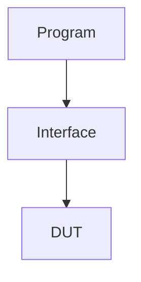

## 목차
- [Review](#review)
	- [logic type](#logic-type)
	- [System Verilog TB 환경](#system-verilog-tb-환경)
	- [class](#class)
	- [Interface - clocking](#interface---clocking)
	- [Interface - Modport](#interface---modport)
- [System Verilog Basic](#system-verilog-basic)
	- [Default Value](#default-value)
	- [Data Arrays](#data-arrays)
		- [1. Fixed Array](#1-fixed-array)
		- [2. Dynamic Array](#2-dynamic-array)
		- [3. Que Array](#3-que-array)
		- [4. Associated Array(Memory Allocation이 산탄적)](#4-associated-arraymemory-allocation이-산탄적)
	- [Array Method](#array-method)
	- [서로 다른 타입 대입](#서로-다른-타입-대입)
	- [Associated Array](#associated-array)
	- [rand, randc](#rand-randc)
	- [$의 의미](#의-의미)
	- [$urandom](#urandom)
	- [randcase](#randcase)
	- [Typedef \& Type cast](#typedef--type-cast)
		- [Typedef](#typedef)
		- [Type cast](#type-cast)
	- [SystemVerilog만의 operator](#systemverilog만의-operator)
		- [inside](#inside)
		- [iff](#iff)
	- [⭐중요한 Operator](#중요한-operator)
		- [Problem Code](#problem-code)
		- [Solution Code](#solution-code)
- [⭐Subroutine(Task \& Function)](#subroutinetask--function)
	- [Task Vs Function](#task-vs-function)
		- [Task](#task)
		- [Function](#function)
	- [Subroutine Argument](#subroutine-argument)
	- [⭐Task의 동작 주의](#task의-동작-주의)
	- [Direct Programming Interface (DPI-C)](#direct-programming-interface-dpi-c)
		- [C언어에서 System Verilog 사용(export)](#c언어에서-system-verilog-사용export)
		- [ref 사용 자제](#ref-사용-자제)
- [Concurrency](#concurrency)
	- [Thread란?](#thread란)
	- [fork-join](#fork-join)
		- [Thread 개수 예시](#thread-개수-예시)
		- [join option](#join-option)
	- [Thread Execution Model](#thread-execution-model)
		- [Example\_1](#example_1)
		- [Example\_2](#example_2)
	- [](#)
		- [Example\_3: Watch Dog](#example_3-watch-dog)
- [실습](#실습)
	- [Dynamic Array](#dynamic-array)
	- [find 함수](#find-함수)
	- [다른 타입 간 할당(2-State \& 4-State)](#다른-타입-간-할당2-state--4-state)
	- [fork-join](#fork-join-1)
		- [1. join\_none: No wait fork](#1-join_none-no-wait-fork)
		- [문제 코드](#문제-코드)
		- [해결 코드](#해결-코드)
		- [2. join\_none: Thread Execution Issues](#2-join_none-thread-execution-issues)
		- [문제 코드](#문제-코드-1)
		- [해결 코드](#해결-코드-1)

# Review
## logic type
- reg, wire를 logic으로 통합하여 사용

## System Verilog TB 환경


## class
- initial, always를 사용할 수 없음
- program과 달리 dynamic함
  - static에 비해 속도가 빠름
    - 메모리를 계속 점유하고 있지 않기 때문

## Interface - clocking
- clocking - endclocking
- clock에 Synchronous하게 동작
  - Non-Blocking

## Interface - Modport
- Asynch
  - Blocking

# System Verilog Basic
## Default Value
- 4-state
  - Unknown(x)
- 2-state
  - 0
## Data Arrays
### 1. Fixed Array
- Array size를 정해둠
  - ex) int b[**2**]
  - 사이즈가 정해짐
- $dimensions
  - vector + array dimension
  - ex) bit[31:0] c[2][3]
  - $dimensions(c) == 3(1(vector) + 2(array))
> MDA: Multi-Dimensional Array(이차원 배열)

### 2. Dynamic Array
- array size가 정해져있지 않음
  - ex) logic [7:0] ID[] = new[16]
  - array의 default size가 없음 
- **new[]**
  - new를 사용하여 dynamic array의 size를 지정해줘야 함
  - 안하면 compile error남
- delete()
  - 할당된 메모리를 de-allocate함
### 3. Que Array
- Push-Pop 구조
- type array_name [**$**[:bound]]
  - 대괄호 안에 $ 가 있으면 Que 타입 Array
  - 보통 bound하여 size를 정해두지 않음
  - unbound를 주로 사용
    - ex) int b[$] : Unbound
- push_back()
  - 배열 뒤쪽에서 넣음
- push_front()
  - 배열 앞쪽에서 넣음
- pop_back()
  - 배열 뒤쪽에서 뺌
- pop_front()
  - 배열 앞쪽에서 뺌
- Index
  - 0: 맨 앞(리눅스 커맨드와 동일)
  - $: 맨 뒤(")

### 4. Associated Array(Memory Allocation이 산탄적)
> 나머지 1~3의 Array는 Memory Allocation이 순차적으로 됨  --> CPU가 메모리 접근하기 쉬움
>> 대신 메모리 점유율이 높음<br>

> Associated Array는 Cpu가 메모리 관리는 어렵지만 메모리 점유율이 낮음

- num()

## Array Method
- find()
  - array에서 value를 찾음
- find_index()
  - ex) array.find_index(addr) with (addr > 3);
  - addr이란 콘텐츠에 대해 3보다 큰 콘텐츠의 index를 찾아라
- foreach()
  - for loop와 동일
  - ex) foreach(array[i])
    - index개수만큼 실행

## 서로 다른 타입 대입
```systemverilog
bit [31:0] count;
logic [31:0] Count = `x;

count = Count;
// 이거 안됨
```

## Associated Array
- ex) a[bit[31:0]]이라고 정의됨
  - 여기에 값이 할당된 index만큼만 메모리가 할당됨
  - 메모리 점유율이 낮음

## rand, randc
- rand: 반복되어서 나올 수 있음
  - 주사위랑 똑같음
- randc: 반복되어서 나올 수 없음
  - 카드 뽑기랑 같음
```systemverilog
rand int my_int;
//랜덤한 int 타입
```

## $의 의미
1. 맨 끝
2. Array에서 Que를 나타냄
3. function을 의미

## $urandom
- rand는 가우시안 분포를 가짐
  - 값이 한쪽으로 치우칠 수 있음
- urand는 일정한 분포를 가짐
  - 값이 어느 한쪽으로 치우치지 않음
  - random test하기 좋은 조건
  - **system verilog에서 새로 등장**
## randcase
- 확률을 정함
```systemverilog
randcase
	10:
	20:
	30:
	50:
endcase
```
- 전체 110(10+20+30+50)중에 확률 할당
- 10의 경우 10/110의 확률로 해당 부분 실행
- 각각의 검증 경우에 대해 확률을 할당
- 확률이 높을수록 집중적으로 봄

## Typedef & Type cast
### Typedef
- C언어랑 동일
- 특정 타입을 쓰기 편하게 정의
### Type cast
- C언어: (바꿀 Type)변수명
  - ex) (unsigned int)var1
- System Verilog: '바꿀타입(변수명)
  - ex) ('unsigned int)(var1)

## SystemVerilog만의 operator
### inside
<br>
### iff
- 해당 조건환경에서만 assertion을 함
- @()같은 event list 혹은 asset문에서 사용
  - if가 대체할 수 없음
## ⭐중요한 Operator
### Problem Code
<br>
### Solution Code
<br>

# ⭐Subroutine(Task & Function)
## Task Vs Function
### Task
- return value X
- 시간의 흐름 존재
  - Blocking 개념
### Function
- return Value O
- 시간의 흐름 X(Conc념rrent)
  - Non-Blocking 개념

## Subroutine Argument<br>
<br>
- 아무것도 안들어가면 default value가 들어감
- 그러나 skip하는 거 보단 **named port list를 권장함**

## ⭐Task의 동작 주의
<br>
- Initializing되있는 변수라도 task에서 처리안하면 x값으로 나옴(**Output인 경우**)
- ❗Output을 Task안에서 꼭 처리해주기!!

## Direct Programming Interface (DPI-C)
- system verilog에서 C/C++을 사용할 수 있음(검증용)
- 사용방법
<br>

### C언어에서 System Verilog 사용(export)
<br>

### ref 사용 자제
- C에서 system verilog를 불러오거나 그 반대의 경우 ref를 되도록 사용하지 말기

# Concurrency
## Thread란?
- 논리적으로 처리하는 프로세서의 단위
> 운영체제가 인식하는 코어의 수

## fork-join
- class는 initial, always사용 X
- Class에서 concurrent 동작 필요
  - fork-join 사용
- ⭐fork-join: Thread가 몇개인지 파악 필요!
  - begin-end: 이 안에서는 Sequential하게 수행
  - begin-end 밖에서는 각각 concurrent하게 동작
<br>
- statement0와 (state1, state2)는 concurrent하게 동작
- 총 Thread의 수는 2개

### Thread 개수 예시
<br>

### join option
<br>
> 해당 코드는 Thread가 3개
- join: 앞에 모든 statement가 끝나야 동작
- join_any: 앞에 statement 중 하나가 끝나면 동작
  - 아직 안끝난 statement도 같이 동작
- join_none: 앞에 state가 끝나지 않더라도 동작

## Thread Execution Model
<br>
- READY: 아직 시간의 흐름이 없음 == Pending
- WAIT: 시간의 흐름 생김
- WAIT que로 넘어가기 위해선 시간의 흐름이 있어야함
### Example_1
1. 안되는 case
<br>
2. 수정해서 되는 case
<br>
- 첫번쨰 Thread에서 시간의 흐름 만들어줌

### Example_2
1. 안되는 경우
<br>
- join_none에 의해 end로 바로 넘어감
- 시뮬레이션 바로 종료
2. 수정한 case
<br>
3. 수정한 경우의 실제 동작(Problem)
<br>
---
[이유]
<br>
4. 해결방법
<br>

### Example_3: Watch Dog
<br>
- 타이머는 위의 thread가 시간 안에 동작하는지 확인용
- 시간 안에 들어와서 join_any가 되면 타이머 동작은 필요X
- disable fork로 쓸데없는 task 중단

# 실습
## Dynamic Array
```systemverilog
module dynamic_array (
	
);
	logic [7:0] ID[], array1[] = new[16];
	logic [7:0] data_array[], mdim[][];

	initial begin
	ID = new[100];
	$display("SIZE OF ID = %0d", ID.size());

	data_array = new[ID.size()] (ID);  // 선 메모리 할당
	data_array = ID;					// 후 대입
	$display("SIZE OF data_array = %0d", data_array.size());

	ID = new[ID.size() * 2] (ID);
	$display("SIZE OF ID = %0d", ID.size()); // 메모리상에서 200만큼 할당됨
	ID = data_array;
    $display("SIZE OF ID = %0d", ID.size()); 
	data_array.delete();
	$display("SIZE OF data_array = %0d", data_array.size());	
	end
endmodule
```
[결과]<br>
<br>
- 처음 할당할 때는 size 200으로 메모리가 잡힘
- size 100의 data_array를 ID에 할당
  - 실제 메모리는 계속 200만큼 잡힘
  - data_array를 할당하면, 값이 100개가 대입될 뿐만 아니라, ID의 size도 100으로 바뀜
  - 실제 메모리는 계속 200만큼 할당됐으며, 100 이후는 X(Unknown)가 할됨됨

## find 함수
```systemverilog
module find_function (
	
);
	
endmodule

program automatic test;

	bit[7:0] SQ_array[$] = {2,1,8,3,5};
	bit[7:0] SQ[$];
	int idx[$];

	initial begin
		SQ = SQ_array.find() with (item > 3);
		
			$display(SQ);
		
		idx = SQ_array.find_index(addr) with (addr > 3);
		
			$display(idx);
		
	end
endprogram
```

[결과]<br>
<br>

## 다른 타입 간 할당(2-State & 4-State)
```systemverilog
program diff_type_assign (

);
 bit[31:0] count;
 logic [31:0] Count = 'x;
 initial begin
	count = Count;
	$display("Count = %0x count = %0d", Count, count);
 end	
endprogram : diff_type_assign
```
[결과]<br>
<br>
- count: 2-state
- Count: 4-state
- 서로 state가 다르므로 할당할 수 없음
- default로 할당됨

## fork-join
### 1. join_none: No wait fork
### 문제 코드
```systemverilog
`timescale 1ns/1ps

program automatic fork_join_loop();
	initial begin
		for(int i =0; i <16 ; i++)begin 
			send(i);
	end	

		$display("time = %0d", $time);
	end

	task  send(int j);
		fork
			begin
				$display("Driving port %0d", j);
				#1ns;
			end
		join_none
	endtask: send 

endprogram: fork_join_loop
```
[결과]
```systemverilog
simulation time			: 0
```
- join_none에 의해 thread 16개가 생성되고 수행은 아직 안함
- 16개의 Thread 생성 후, for문이 종료되고 Thread가 수행되기 전에 end를 만나고 Simulation 종료
- 그 결과 task 수행 없이 시뮬레이션이 0ms에서 종료됨
### 해결 코드
```systemverilog
`timescale 1ns/1ps

program automatic fork_join_loop();
	initial begin
		for(int i =0; i <16 ; i++)begin 
			send(i);
	end	
		wait fork;
		$display("time = %0d", $time);
	end

	task  send(int j);
		fork
			begin
				$display("Driving port %0d", j);
				#1ns;
			end
		join_none
	endtask: send 

endprogram: fork_join_loop
```
[결과]<br>
<br>
- 16개의 thread 생성되고, for문 벗어남
- wait fork;를 통해, fork에 의한 Thread가 수행될 때까지 기다림
- 모든 Thread가 종료되고 시뮬레이션 끝남
```systemverilog
fork : thread1
$display;
#1;
join

...

fork : thread16
$display;
#1;
join
```
- 각각의 fork-join Thread들이 Concurrent하게 수행되고, 1ns가 지난 후에 시뮬레이션이 종료됨

### 2. join_none: Thread Execution Issues
### 문제 코드
```systemverilog
`timescale 1ns/1ps

program automatic fork_join_repeat_16();
	initial begin
		for(int i =0; i <16 ; i++)begin 
			fork
				send(i);
			join_none
	end	
		wait fork;
		//$display("index = %0d", i);
		$display("time = %0d", $time);
	end

	task  send(int j);
			begin
				$display("Driving port %0d", j);
				#1ns;
			end
	endtask: send 
endprogram: fork_join_repeat_16
```
[결과]<br>
<br>
- 0부터 15까지 찍히지 않음

[원인]<br>
- for문 안에서 16개의 Thread 생김
- 생긴 다음에 int i가 반영되어 16이 display됨
- for문안에서 fork-join_none에 의해 Thread 16개가 쫘라락 생기고, 그 후에 wait fork만날 때, i는 이미 16인 상태임
- 그래서 모든 Thread가 16값으로 출력됨

### 해결 코드
```systemverilog
`timescale 1ns/1ps

program automatic fork_join_repeat_16();
	initial begin
		for(int i =0; i <16 ; i++)begin 
			fork
				int index = i;
				$display("index = %0d", index);
				send(index);
			join_none
	end	
		wait fork;
		//$display("index = %0d", i);
		$display("time = %0d", $time);
	end

	task  send(int j);
			begin
				$display("Driving port %0d", j);
				#1ns;
			end
	endtask: send 

endprogram: fork_join_repeat_16
```
[결과]<br>

- 0부터 15까지 잘 찍힘

[해결]<br>
- for문 안에서 index에 의해 i값이 **Copy**해서 들어감
- 초기화(선언)는 Thread가 아님
- ⭐값이 Copy해서 들어간다는게 Key point
- 이전에 문제가 된 경우는 값을 Copy해서 들어가는 것이 아닌, Thread 생성 후, int i가 직접 들어감
- Thread에서 값을 받을 때 그때 그때, 값을 Copy해서 들어가므로 값이 0부터 15까지 잘 찍힘