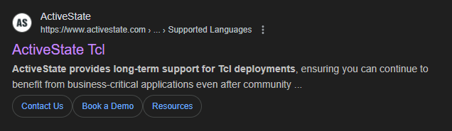
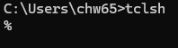
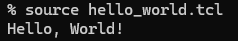

## 목차
- [Window에 TCL 설치하기](#window에-tcl-설치하기)
- [코드연습 시작 국룰: Hello World!](#코드연습-시작-국룰-hello-world)
- [Set 명령어](#set-명령어)
	- [set 명령](#set-명령)
	- [set 명령 특징](#set-명령-특징)
	- [사용 예제](#사용-예제)
		- [1. 이름 설정](#1-이름-설정)
		- [2. 띄어쓰기가 포함된 문자열](#2-띄어쓰기가-포함된-문자열)
		- [3. 배열](#3-배열)
		- [4. Associative Array](#4-associative-array)
	- [set 고급 기능](#set-고급-기능)
	- [변수 Constraint](#변수-constraint)
		- [1. 변수명 제한](#1-변수명-제한)
		- [2. 값 제한](#2-값-제한)
	- [특수 문자 처리](#특수-문자-처리)
		- [1. Quote 포함("")](#1-quote-포함)
		- [2. Bracket 포함(\[\])](#2-bracket-포함)
		- [3. Dollar 기호 포함($)](#3-dollar-기호-포함)
- [Unset 명령](#unset-명령)
	- [unset 명령](#unset-명령-1)
	- [사용 예시](#사용-예시)
	- [Unset 특징](#unset-특징)
- [Tip](#tip)

> TCL이란
> > Tool Command Language<br>
> > Tool을 사용하기 위한 통합언어

# Window에 TCL 설치하기
1. ActiveState TCL에서 "ActiveTcl"설치
<br>
> 공홈에 다운로드 카테고리 있다는 데 안보임
2. Download Site
[ActiveTcl Download](https://platform.activestate.com/ActiveState/TclTk-RecommendedVersion)
3. cmd열어서 "tclsh"입력해서 tcl되는지 확인
<br>
> 이렇게 되면 성공

# 코드연습 시작 국룰: Hello World!
1. Hello World 파일만들기
```tcl
puts "Hello, World!"
```
2. 실행결과
 
<br>

# Set 명령어
## set 명령
- set 명령
  - 변수를 생성
  - 값을 할당
```tcl
	set 변수명 값
```
## set 명령 특징
- 변수의 생성과 값 할당을 동시에 수행
  - C언어의 초기화
    - 선언과 대입을 동시에 수행
- 기존 변수값을 변경 가능
- 변수 값 읽기에도 사용가능

## 사용 예제
### 1. 이름 설정
<br>

### 2. 띄어쓰기가 포함된 문자열
<br>

### 3. 배열
<br>
- C언어와 달리 숫자 사이에 쉼표를 넣어주지 않는다

### 4. Associative Array
<br>
- 배열 안에 키값으로 배열 값 설정
- 키가 인덱스로 들어감
  - TCL 명령어에만 있는 개념은 아님

## set 고급 기능
- 띄어쓰기를 포함하여 값을 할당 가능
  - 배열: set 변수명 {값1 값2}
  - 문자열: set 변수명 "값1 값2"
- 배열 요소 설정
  - set 변수명(키) 값
    - 위 예제 4번 참고
- 변수값 읽기
  - set은 변수를 읽는데도 사용함

## 변수 Constraint

### 1. 변수명 제한
- 시작: 문자, 숫자, (_)만 가능
- 공백, 특수문자 사용불가능
- 예약어 사용불가
> C언어와 같음

### 2. 값 제한
- C언어처럼 자료형이 있어서 값의 범위가 정해져 있지는 않음
  - 기본적으로 할당값에 제한이 없음
- 모든 값은 **문자열 형태**로 저장됨
- 메모리 한계까지 긴 문자열 가능
  - 근데..... 이만큼 필요할까

## 특수 문자 처리

### 1. Quote 포함("")
<br>
- 중괄호 안에 문자열을 넣으면 특수 문자 구분을 위한 \ 필요 없음
- 문자열 형식 "" 안에서 특수 문자를 쓰는 경우 "\"로 문자임을 구분해줘야 함

### 2. Bracket 포함([])
<br>

### 3. Dollar 기호 포함($)
<br>

# Unset 명령

## unset 명령
- 변수를 삭제하는 명령어

## 사용 예시
<br>
- 변수 x가 삭제되어 puts 명령어로 읽지 못하는 것을 확인할 수 있다

## Unset 특징
- 여러 변수를 동시에 삭제 가능
  - unset 변수1 변수2 변수3
- 배열 요소 삭제
  - unset arr(key)
- 전체 배열 삭제
  - unset arr

# Tip
- 변수 존재 여부 확인
  - ```info exist 변수명```
- 전역 변수 선언
  - ```global 변수명```
- 임시 변수 관리
  - 사용 후 쓰지않는 변수는 메모리관리를 위해 unset으로 지워준다
- 리눅스 환경변수는 env에 저장되어있음

