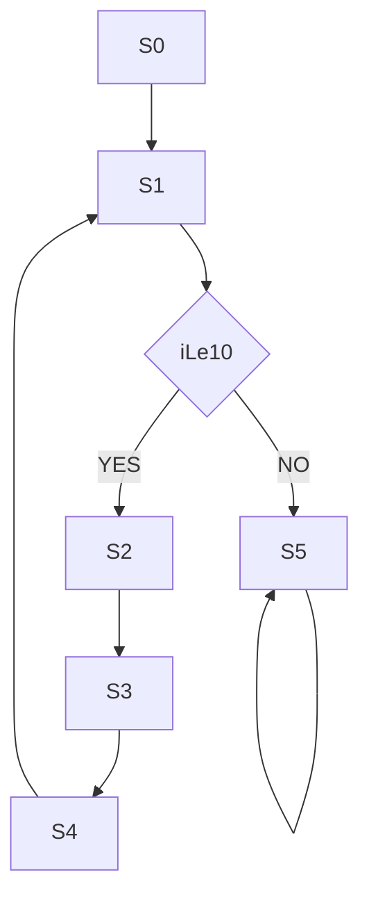

# 과제 Review

> Dedicated Processor: 0~10 Accumulate Sum

## 1. C언어 Modeling

```c
int i = 0;
int sum = 0;
int outport = 0;

while (i <= 10){
	sum = sum + i;
	i = i + 1;
	outport = sum;
}

halt;
```

## 2. Data Path 설계

<br>

- 변수 --> Register로 치환
- 초기화
  - 0 입력
- i <= 10
  - 비교기
- sum + i
  - Adder
- sum = sum + i	/ i = i + 1
  - MUX로 REG 입력 선택
- i + 1

⭐⭐⭐⭐⭐⭐⭐⭐⭐⭐⭐⭐⭐⭐⭐<br>
  - MUX를 사용해서 **Adder 1개**만 사용
  - 회로 사이즈 감소❗❗
  - 그리고 실제 CPU는 명령어 1개씩 수행
  - adder가 2개면 --> 두 라인을 동시에 처리하는 것과 같음
  - 근데 실제 CPU는 ALU가 1개임

⭐⭐⭐⭐⭐⭐⭐⭐⭐⭐⭐⭐⭐⭐⭐
- Output
  - Out Buffer(3-state buffer)

 ## 3. Control_Unit - ASM Chart

 |       **Instruction**        | **Sum_Src_Mux_Sel** | **i_Src_Mux_Sel** | **Sum_En** | **i_En** | **Adder_Src_Mux_Sel** | **Out_Buf_En** |
 | :--------------------------: | :-----------------: | :---------------: | :--------: | :------: | :-------------------: | :------------: |
 |     **i=0, sum=0**<br>S0     |          0          |         0         |     1      |    1     |           X           |       0        |
 | **i<=10**<br>**iLe10**<br>S1 |          X          |         X         |     0      |    0     |           X           |       0        |
 |     **sum=sum+i**<br>S2      |          1          |         X         |     1      |    0     |           0           |       0        |
 |       **i=i+1**<br>S3        |          X          |         1         |     0      |    1     |           1           |       0        |
 |   **outport = sum**<br>S4    |          X          |         X         |     0      |    0     |           X           |       1        |
 |        **halt**<br>S5        |          X          |         X         |     0      |    0     |           X           |       0        |




# Upgrade - Register File

- 변수 1개당 레지스터 1개
- 변수 여러 개면 어떻게 관리?
  - --> **Register File**
- 훨씬 시스템 관리하기 간단해짐

<br>

> Assembly Language 접근

⭐R0는 항상 0으로 고정
---

```asm
R1 = 0;
R2 = 0;
while(R1<=10){
	R2 = R2 + R1;
	R1 = R1 + R3;		//R3 == 1
	outport = R2;
}

halt;
```

## DataPath 

<br>

## Control Unit - ASM Chart

|   **Instruction**    | **RFSrcMuxSel** | **r_addr_1** | **r_addr_2** | **wr_addr** | **wr_en** | **OutPortEn** |
| :------------------: | :-------------: | :----------: | :----------: | :---------: | :-------: | :-----------: |
|   **R1 = 0**<br>S0   |        0        |      0       |      0       |      1      |     1     |       0       |
|   **R2 = 0**<br>S1   |        0        |      0       |      0       |      2      |     1     |       0       |
|   **R3 = 1**<br>S2   |        1        |      X       |      X       |      3      |     1     |       0       |
|   **R1<=10**<br>S3   |        X        |      1       |      X       |      X      |     0     |       0       |
|  **R2=R2+R1**<br>S4  |        0        |      1       |      2       |      2      |     1     |       0       |
|  **R1=R1+R3**<br>S5  |        0        |      1       |      3       |      1      |     1     |       0       |
| **OutPort=R2**<br>S6 |        X        |      2       |      X       |      X      |     0     |       1       |
|    **halt**<br>S7    |        X        |      X       |      X       |      X      |     0     |       0       |

