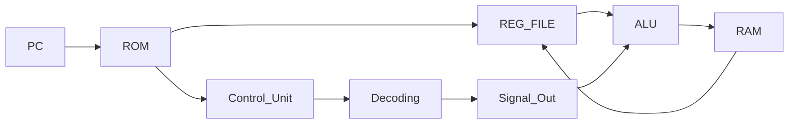

# Multi-Cycle RV32I

## Single Cycle의 문제점

### RV32I Data Flow

|              이해를 위한 예시 그림               |
| :----------------------------------------------: |
|  |

- 1 Cycle안에 처리하는 Path의 길이가 매우 길다
- 클럭 주기가 길어지게 된다
- 속도가 느려진다

## Multi-Cycle Solution

|              이해를 위한 예시 그림               |
| :----------------------------------------------: |
|  |

|     &nbsp;     |                                    **Stage**                                    |
| :------------: | :-----------------------------------------------------------------------------: |
|   **Fetch**    |                      PC에서 받은 명령어를 출력 PC - ROM                      |
|   **Decode**   |            Control Unit에서 명령어 해석 Control Unit Signal 출력             |
|  **Execute**   | Control Unit에서 나온 제어신호를 바탕으로 연산 수행 ALU연산 혹은 PC 점프판단 |
| **MemAccess**  |                    RAM에 데이터 입력 RAM: Addr, We, Wdata                    |
| **Write_Back** |             RAM에서 데이터 출력 RAM: Addr, ReadData-RegFile저장              |

- Single Cycle의 각 처리과정을 나누어 각 과정을 1클럭 단위로 처리
- 1 Cycle안에 처리할 Path길이 줄어듦
- 클럭 Frequency를 높일 수 있음
- 속도 증가

### Block Diagram에서

|                   Stages in HW                   |
| :----------------------------------------------: |
|  |

- 명령어 타입별로 거치는 Stage 개수가 다름
  - R, B등 연산: Execute까지 수행
  - S: MemAccess까지 수행
  - L: WriteBack까지 수행
- 타입별로 진행 스테이지를 나눔
  - 타입별 클럭 수를 최적화 가능

> Pipe-Lining과 차이
> > **Pipe-Line**: 매 클럭마다 PC에서 ROM으로 명령어 주소가 나옴 
> > **Multi-Cycle**: 하나의 명령어가 끝날때까지 PC에서 ROM으로 명령어를 전달X

## Single => Muti-Cycle HW 변경점
> ⭐각 Stage별 출력부에 Register가 추가된다
> > ⚠️이 때, 해당 Register들은 enable신호가 없다 
> > 단, PC는 enable신호가 존재

### Fetch
- PC
  - en신호를 받아야함
  - 매 클럭마다 명령어를 내보내면 안됨
  - 명령어가 모든 stage를 수행한 후, PC를 동작시켜야함
    - 명령어 타입별로 소모 클럭 수가 다름

### Decode
- Control Unit
  - 명령어 타입별 FSM제어
