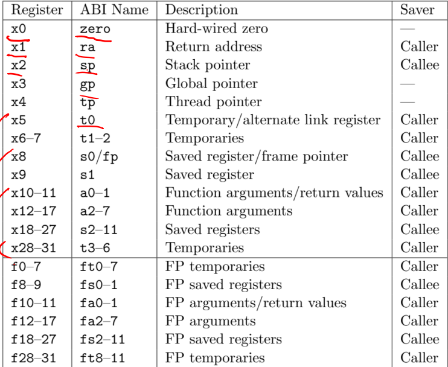
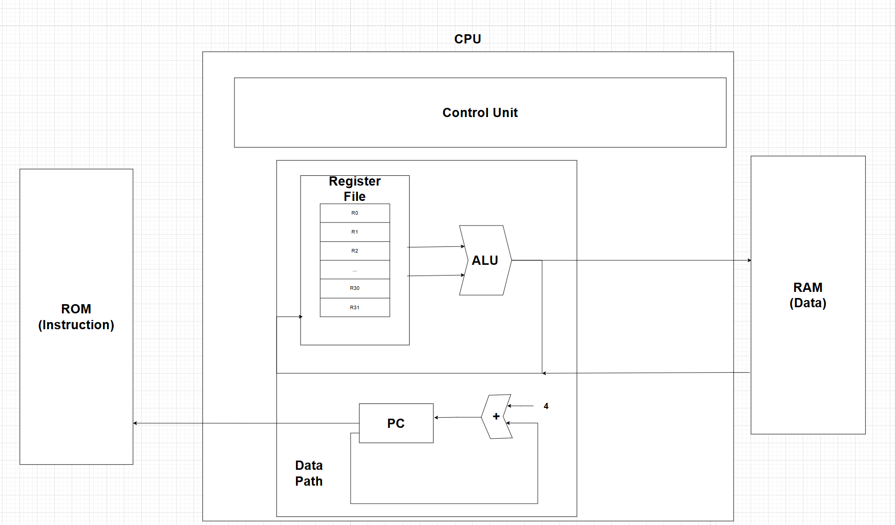

# RV32I

## RV32 Architecture

### 1. Single-Cycle Architecture
- 모든 instruction이 1clk 안에 동작함

장점)
- 구조가 매우 **단순함**

단점)
- 느림

### 2. Multi-cycle Architecture
- 명령어 Type별로 동작 Clock 수가 다름

장점)
- Single Cycle보다 조금 빠름

단점)
- Single Cycle보다 구조가 복잡

### Pipe-Line Architecture
- 명령어를 여러 Stage로 나누어 처리
- 각 Stage가 Parallel하게 처리되는 효과
  - 속도⬆️

장점)
- 속도가 굉장히 빠름

단점)
- 구조가 많이 복잡함
- Hazard⭐
  - Structure Hazard
    - 하나의 자원에 대해 여러 명령이 동시에 수행될 때
  - Data Hazard
    - 아직 명령어 처리가 끝나지 않은 Register를 접근할 때
  - Control Hazard
    - 분기 명령어에 의해 처리되지 않을 명령어가 파이프라인에 들어온 경우

## RV32I 특징

1. 32bit, 32개 Register로 구성
> Program Counter는 따로 구성
2. Instruction Code도 32bit

|               **Register Description**                |
| :---------------------------------------------------: |
|  |

- 32개의 Register로 구성됨
- 각 Register는 역할(ABI Name)을 가짐
- ⭐R0 register는 항상 0으로 **Fix**

## CPU 기본 구조(Havard Architecture)
> Havard Architecture
> > Instruction Mem(ROM), Data Mem(RAM)이 따로 있음

|                  RV32I 기본구조                  |
| :----------------------------------------------: |
|  |

- Register File
  - 
- ALU
- ROM(Instruction Memory)
  - 최근엔 Flash Memory를 많이 사용
    - 지웠다 다시 쓰기 가능
- RAM(Data Memory)
- PC
  - Program Counter

|      &nbsp;       |                        CPU 기본 구성                         |
| :---------------: | :----------------------------------------------------------: |
| **Register File** |            32개의 범용 레지스터를 저장하는 메모리            |
|      **ALU**      |            산술연산 및 논리 연산을 수행하는 로직             |
|      **ROM**      | **Instruction** Memory Instruction Code를 저장하는 메모리 |
|      **RAM**      |         **Data** Memory 데이터를 저장하는 메모리          |
|      **PC**       | Program Counter 다음 리행할 명령어 주소를 저장하는 메모리 |
