# RV32I-R Type

## ⚙️R-Type 역할

- **범용 레지스터** 간 연산을 수행한다
- R Type 연산 수행과 결과는 **Register File**에 한정되어 수행된다

|           **R-Type Base Instruction Code**           |
| :--------------------------------------------------: |
| 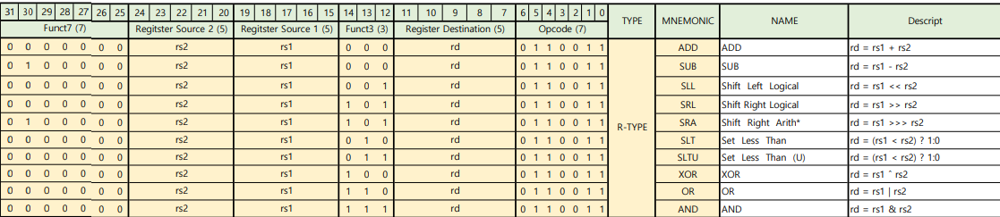 |

- 10가지 연산 존재

### 📝Logical & Arithmetic 연산

|  &nbsp;  | **Arithmetic(Sign Extenstion)** | **Logical(Zero Padding)** |
| :------: | :-----------------------------: | :-----------------------: |
| **SLL**  |             &nbsp;              |             O             |
| **SRL**  |             &nbsp;              |             O             |
| **SRA**  |                O                |          &nbsp;           |
| **SLT**  |                O                |          &nbsp;           |
| **SLTU** |             &nbsp;              |             O             |

## 💻R-Type HW Architecture

|                **R-Type HW Architecture**                 |
| :-------------------------------------------------------: |
| 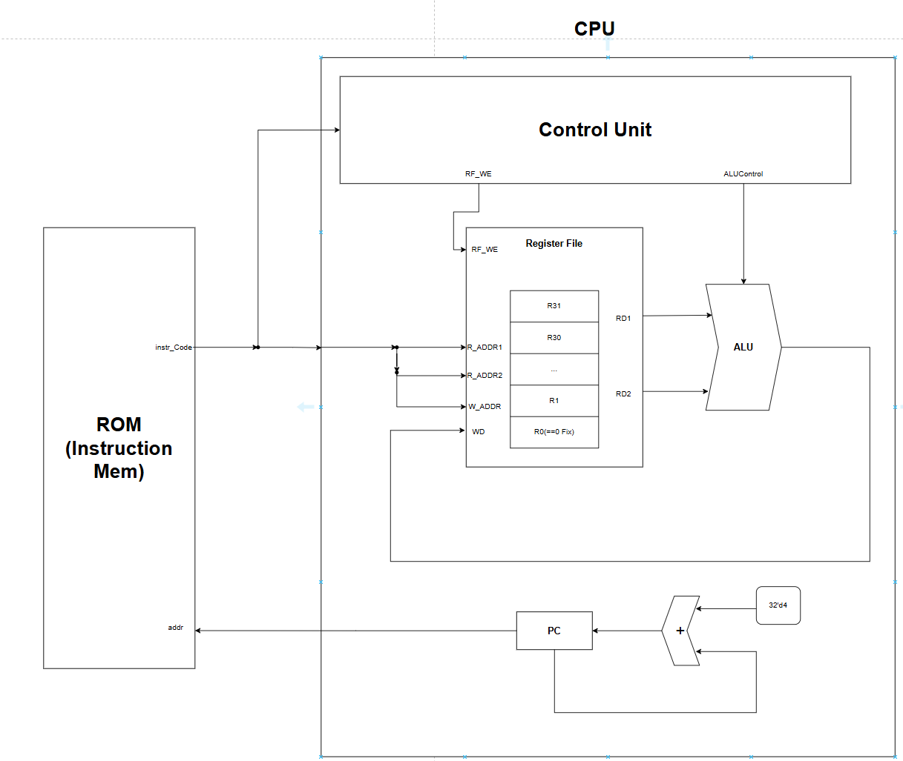 |

### ROM(Instruction Memory)
- PC로부터 받은 주소에 해당하는 명령어를 CPU에 전달한다
- opcode, function, register address등의 정보를 포함한다

### Register File
- 32개의 범용 레지스터를 저장하는 메모리
- ⭐**R0**는 항상 0값을 저장한다
  - RISC-V 규약
- Instruction code로부터 Register Address를 받아, 해당하는 주소의 data를 출력하고, 저장한다
  - Read Address & Write Address
- 레지스터 간 연산의 결과를 Write Data 포트를 통해 전달받아 메모리에 저장한다

### ALU(Arithmetic Logical Unit)
- 산술 및 논리 연산을 처리한다
- 계산을 수행하는 코어 로직

### PC(Program Counter)
- 다음 수행할 명령어의 주소를 저장하고 ROM에게 알려주는 역할을 수행
- 한 사이클마다 4씩 증가시켜 저장
  - 32bit Processor == 4Byte
  - 메모리 주소 단위가 4씩 증가(Offset == 4)

### Control Unit
- Instruction Code를 바탕으로 Data Path에 적절한 Control Signal을 보내준다

# 🔍Simulation 검증

## ⚙️RegisterFile Setting

```verilog
//////////////////////////////////TEST용
    initial begin
        for (int i = 0; i < 32; i++) begin
            mem[i] = 10 + i;
        end
        mem[15] = 32'b1111_0000_0000_0000_0000_0000_0000_0000;
    end
/////////////////////////////////
```

- Register File의 각 메모리에 대해 (10+레지스터번호)를 초기값으로 넣어줌

## ⚙️ROM Setting

```verilog
//////////////////////////////////TEST용
    initial begin
        //rom[x] = 32'b func7 _ rs2 _ rs1 _ func3 _ rd _ op
        rom[0] = 32'b0000000_00001_00010_000_00100_0110011;    //add x4, x2, x1
        rom[1] = 32'b0100000_00001_00010_000_00101_0110011;    //sub x5, x2, x1
        rom[2] = 32'b0000000_00001_00100_001_00110_0110011;    //sll x6, x4, x1
        rom[3] = 32'b0000000_00011_00101_101_00111_0110011;    //srl x7, x5, x3
        rom[4] = 32'b0100000_00010_01111_101_01000_0110011;    //sra x8, x15, x2
        rom[5] = 32'b0000000_01000_00111_010_01001_0110011;    //slt x9, x7, x8
        rom[6] = 32'b0000000_01110_01111_011_01010_0110011;    //sltu x10, x13, x12
        rom[7] = 32'b0000000_00001_00100_100_01011_0110011;    //xor x11, x4, x1
        rom[8] = 32'b0000000_00011_00010_110_01100_0110011;    //or x12, x2, x3
        rom[9] = 32'b0000000_00111_00101_111_01101_0110011;    //and x13, x5, x7
    end
//////////////////////////////////
```

## ✔️Simulation Verification

### ADD

```verilog
//Machine Code
rom[0] = 32'b0000000_00001_00010_000_00100_0110011;    //add x4, x2, x1 //x4 = x2 + x1
```

|               add x4, x2, x1               |
| :----------------------------------------: |
| 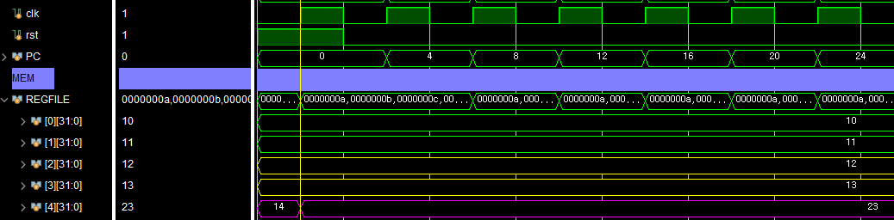 |

- PC == 32'd0 (ROM[0]) 수행
- x4(23) = x2(12) + x1(11)
  - ✅정상수행되는 것을 확인할 수 있다

### SUB

```verilog
//Machine Code
rom[1] = 32'b0100000_00001_00010_000_00101_0110011;    //sub x5, x2, x1
```

|               sub x5, x2, x1               |
| :----------------------------------------: |
| 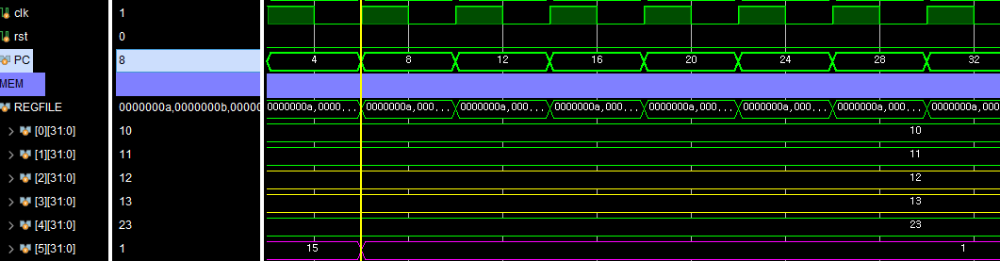 |

- PC == 32'd0 (ROM[0]) 수행
- x5(1) = x2(12) - x1(11)
  - ✅정상수행되는 것을 확인할 수 있다

### SLL

```verilog
//Machine Code
rom[2] = 32'b0000000_00001_00100_001_00110_0110011;    //sll x6, x4, x1
```

|               sll x6, x4, x1               |
| :----------------------------------------: |
| 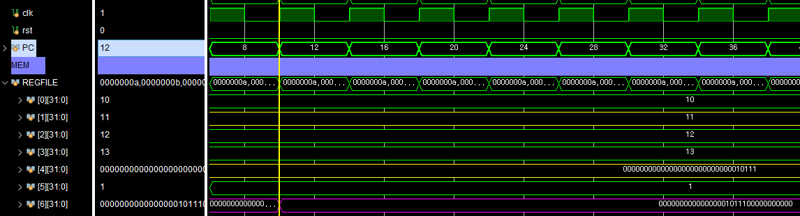 |


|     X4(rs1)     |   32'b0000_0000_0000_0000_0000_0000_0001_0111   |
| :-------------: | :---------------------------------------------: |
| X1(shift value) |                     32'd11                      |
|     X6(rd)      | 32'b0000_0000_0000_0000_1011_1**000_0000_0000** |

- ✅11만큼 왼쪽으로 Shift 된 것을 확인할 수 있다

### SRL

```verilog
//Machine Code
rom[3] = 32'b0000000_00011_00101_101_00111_0110011;    //srl x7, x5, x3
```

|               srl x7, x5, x3               |
| :----------------------------------------: |
| 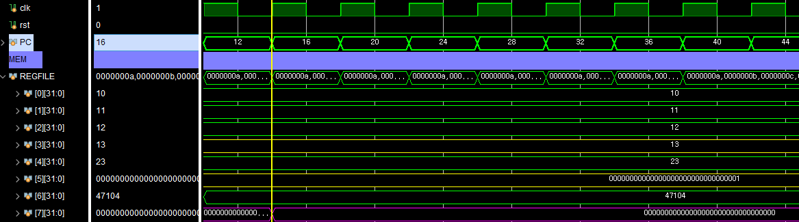 |


|     X5(rs1)     | 32'0000_0000_0000_0000_0000_0000_0000_0001  |
| :-------------: | :-----------------------------------------: |
| X3(shift value) |                   32'd13                    |
|     X7(rd)      | 32'b0000_0000_0000_0000_0000_0000_0000_0000 |

- ✅Right Shift를 하여 값이 0이 된 것을 확인할 수 있다

### SRA

```verilog
//Machine Code
rom[4] = 32'b0100000_00010_01111_101_01000_0110011;    //sra x8, x15, x2 
```

|              sra x8, x15, x2               |
| :----------------------------------------: |
| 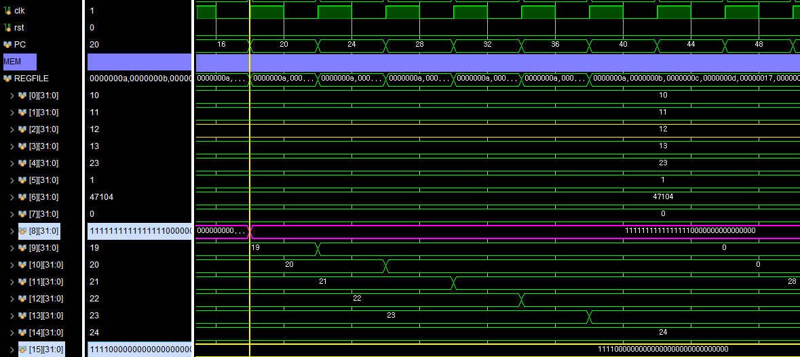 |


|    X15(rs1)     |   32'1111_0000_0000_0000_0000_0000_0000_0000    |
| :-------------: | :---------------------------------------------: |
| X2(shift value) |                     32'd12                      |
|     X8(rd)      | 32'b**1111_1111_1111**_1111_0000_0000_0000_0000 |

- ✅Arithmetic Shift 연산에 맞게 MSB를 확장하면서(**Sign Extension**) Shift를 수행하는 것을 확인

### SLT

```verilog
//Machine Code
rom[5] = 32'b0000000_01000_00111_010_01001_0110011;    //slt x9, x7, x8
```

|               slt x9, x7, x8               |
| :----------------------------------------: |
| 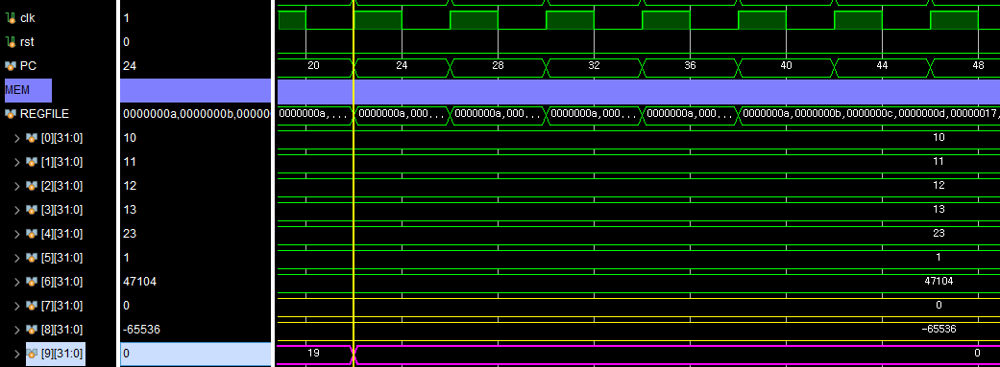 |

- (Signed) Set Less Than
- X7: 0
- X8: -65536
- X7 < X8 => False
  - X9 <= 0
- ✅정상 연산 

### SLTU

```verilog
//Machine Code
rom[6] = 32'b0000000_01110_01111_011_01010_0110011;    //sltu x10, x13, x12
```

|             sltu x10, x13, x12              |
| :-----------------------------------------: |
| 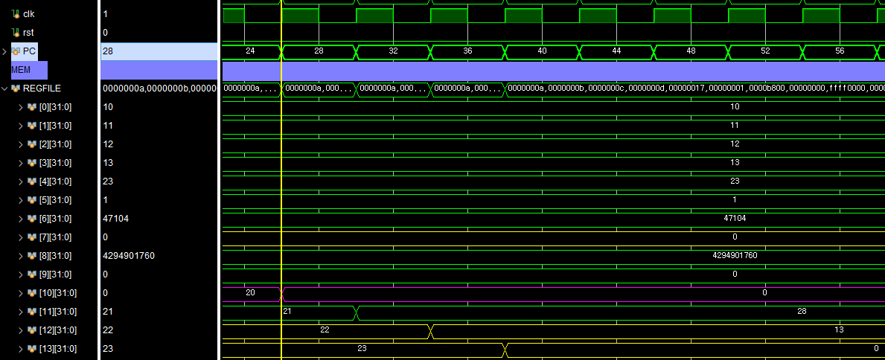 |

- X13: 23
- X12: 22
- X13 < X12 => False
- X10 = 0
- ✅정상  연산

### XOR

```verilog
//Machine Code
rom[7] = 32'b0000000_00001_00100_100_01011_0110011;    //xor x11, x4, x1
```

|              xor x11, x4, x1               |
| :----------------------------------------: |
| 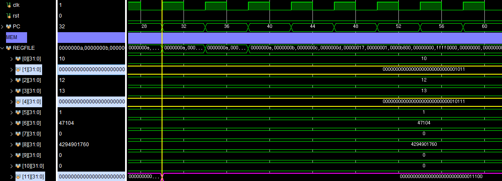 |


| X4(rs1) | 32'b0000_0000_0000_0000_0000_0000_000**1_0111** |
| :-----: | :---------------------------------------------: |
| X1(rs2) | 32'b0000_0000_0000_0000_0000_0000_000**0_1011** |
| X8(rd)  | 32'b0000_0000_0000_0000_0000_0000_000**1_1100** |

- ✅XOR 연산 정상 수행

### OR

```verilog
//Machine Code
rom[8] = 32'b0000000_00011_00010_110_01100_0110011;    //or x12, x2, x3
```

|              or x12, x2, x3               |
| :---------------------------------------: |
| 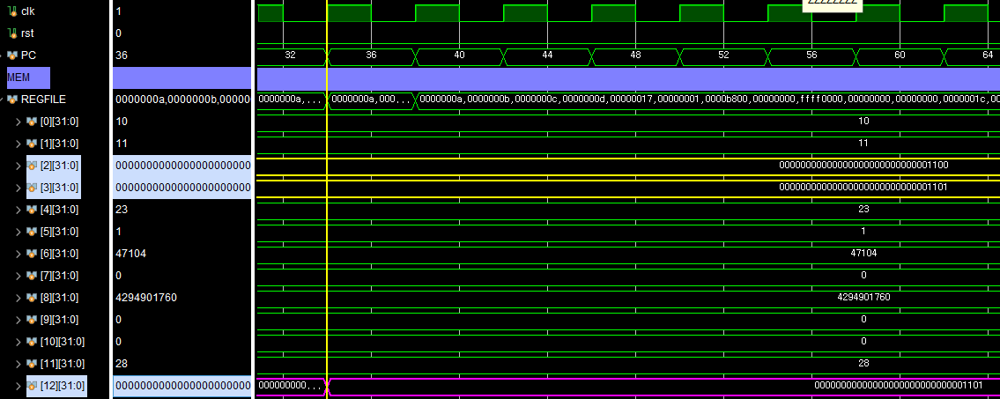 |

| X2(rs1) | 32'b0000_0000_0000_0000_0000_0000_0000_**1100** |
| :-----: | :---------------------------------------------: |
| X3(rs2) | 32'b0000_0000_0000_0000_0000_0000_0000_**1101** |
| X12(rd) | 32'b00000_000_0000_0000_0000_0000_0000_**1101** |

- ✅OR 연산 정상 수행

### AND

```verilog
//Machine Code
rom[9] = 32'b0000000_00111_00101_111_01101_0110011;    //and x13, x5, x7
```

|              and x13, x5, x7               |
| :----------------------------------------: |
| 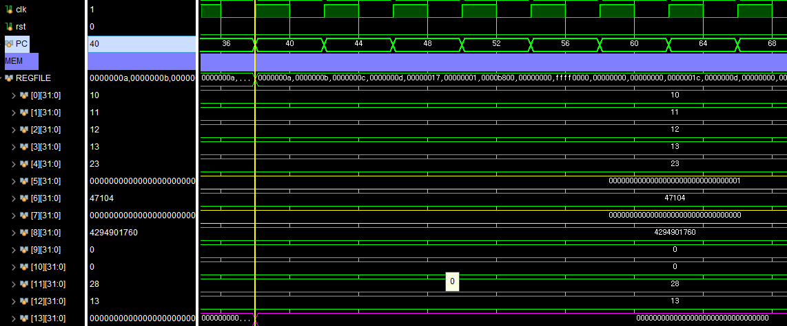 |

| X5(rs1) | 32'b0000_0000_0000_0000_0000_0000_0000_**0001** |
| :-----: | :---------------------------------------------: |
| X7(rs2) | 32'b0000_0000_0000_0000_0000_0000_0000_**0000** |
| X13(rd) | 32'b0000_0000_0000_0000_0000_0000_0000_**0000** |

- ✅AND 연산 정상 수행

