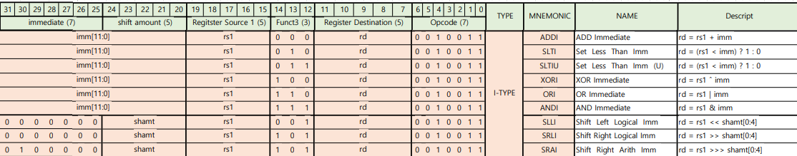
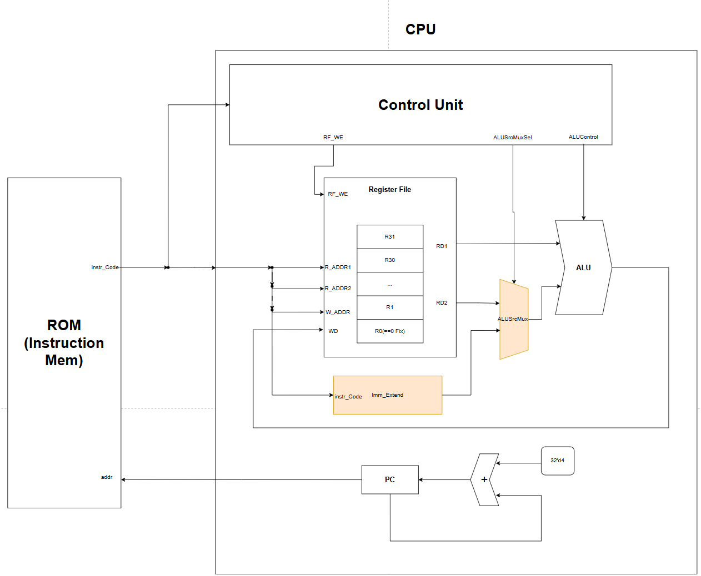
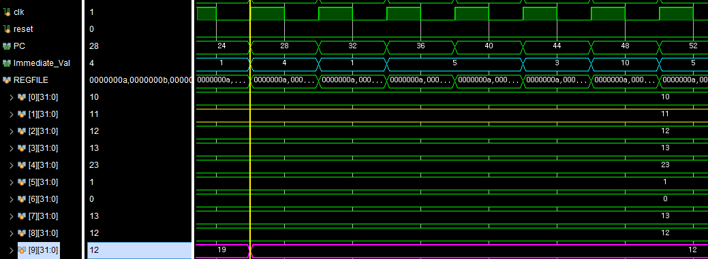
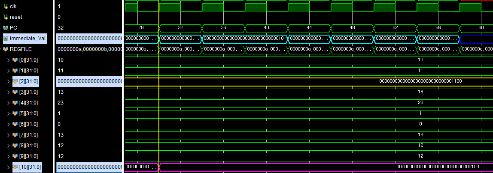
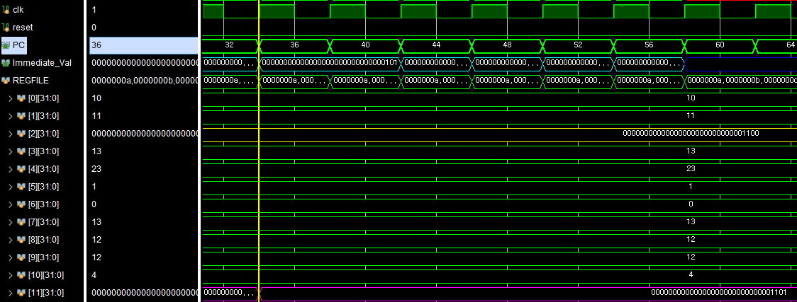
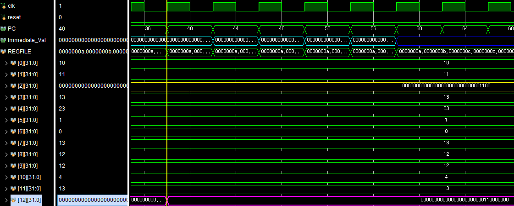
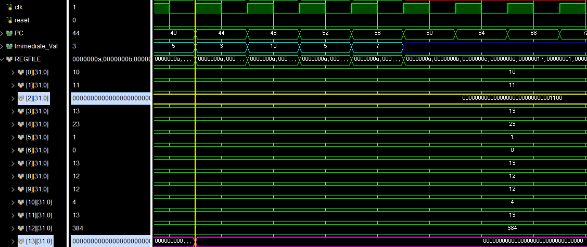
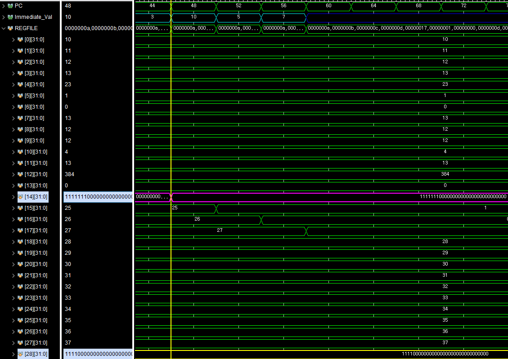
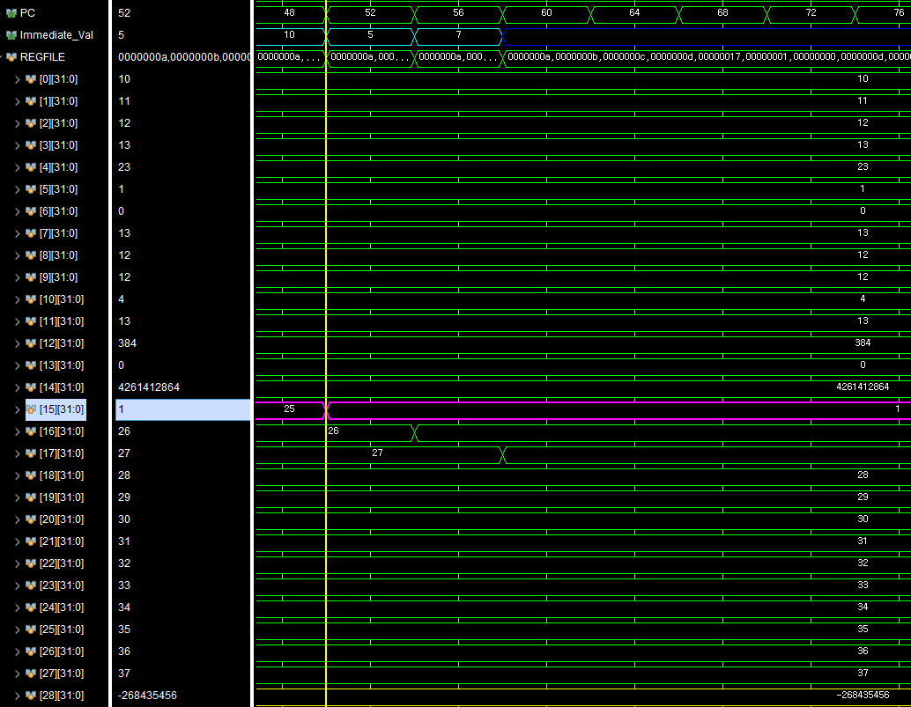

# RV32I-I Type

## ⚙️I-Type 역할

- 단일 레지스터와 **Immediate Value**(상수)와의 연산을 수행
- R Type 연산 수행과 결과는 **Register File**에 한정되어 수행된다

|           **I-Type Base Instruction Code**            |
| :---------------------------------------------------: |
|  |

- ❗**SLLI**, **SRLI**, **SRAI**는 Immediate 범위가 다른 연산과 다름
  - 설계시 고려 사항

## 💻I-Type HW Architecture

|                **I-Type HW Architecture**                 |
| :-------------------------------------------------------: |
|  |

### Imm_Extend
- Instruction Code에서 들어오는 Immediate 비트수
  - imm[11:0] == 12bit
    - SLLI, SLRI, SRAI == 5bit
  - 이를 32비트로 확장해줘야함
- 확장시키는 추가 모듈

❗SLLI, SLRI, SRAI
---
- 나머지 다른 연산의 경우 부족한 20비트를 MSB로 채우면 됨
- 위의 3개의 연산에 대해선 어떻게 진행해야되는가
- Instruction Code의 **func3**를 보고 결정함

[코드 구현]
```verilog
//immm_Extend에서 발췌
case(opcode) begin
	...

	`OP_TYPE_I: begin
                case (func3)
                    3'b001:  immExt = {27'b0, instrCode[24:20]};  //SLLI
                    3'b011:  immExt = {20'b0, instrCode[31:20]};  //SLTIU
                    3'b101:  immExt = {27'b0, instrCode[24:20]};  //SRLI, SRAI
                    default: immExt = {{20{instrCode[31]}}, instrCode[31:20]};
                endcase
            end
	...
end
```
- Instruction Code에서 func3에 해당하는 3비트를 보고 확장 방식을 결정함
- SLLI(3'b001), SRLI, SRAI(3'b101), SRAI(3'b011)의 경우
  - 다른 Case와 달리 Zero Padding을 수행

### ALUSrcMux
- R-Type
  - Register File에서 나오는 rs1과 rs2가 ALU로 들어감
- I-Type
  - Register File에서 나오는 rs1과 Instruction Code에서 전달되는 immediate Value가 ALU에 들어감
- rs2와 immediate value중 alu에 들어갈 값을 선택해줘야함 => **Mux**

# 🔍Simulation 검증

## ⚙️RegisterFile Setting

```verilog
//////////////////////////////////TEST용
	initial begin  // for simulation test
        for (int i = 0; i < 32; i++) begin
            mem[i] = 10 + i;
        end
        mem[28] = 32'b1111_0000_0000_0000_0000_0000_0000_0000;
    end
/////////////////////////////////
```

- Register File의 각 메모리에 대해 (10+레지스터번호)를 초기값으로 넣어줌

## ⚙️ROM Setting

```verilog
//////////////////////////////////TEST용
	//rom[x]=32'b imm12 _ rs1 _f3 _ rd  _ op  //I-Type
    rom[6] = 32'b000000000001_00001_000_01001_0010011;//addi x9, x1, 1
    rom[7] = 32'b000000000100_00010_111_01010_0010011;//andi x10, x2, 2
    rom[8] = 32'b000000000001_00010_110_01011_0010011;//ori x11, x2, 1
    rom[9] = 32'b000000000101_00010_001_01100_0010011;//slli x12, x2, 5
    rom[10] = 32'b000000000101_00010_101_01101_0010011;//srli x13, x2, 5
    rom[11] = 32'b010000000011_11100_101_01110_0010011;//srai x14, x28, 3
    rom[12] = 32'b000000001010_11100_010_01111_0010011;//slti x15, x28, 10
    rom[13] = 32'b000000000101_00010_011_10000_0010011;//sltiu x16, x2, 5
    rom[14] = 32'b000000000111_00001_100_10001_0010011;//xori x17, x1, 7
//////////////////////////////////
```

## ✔️Simulation Verification

### ADDI

```verilog
//Machine Code
rom[6] = 32'b000000000001_00001_000_01001_0010011;//addi x9, x1, 1
```

|               addi x9, x1, 1                |
| :-----------------------------------------: |
|  |

| X1(rs1) | 32'd11 |
| :-----: | :----: |
|   Imm   | 32'd1  |
| X9(rd)  | 32'd12 |

- x9(12) = x1(11) + imm(1)
  - ✅정상수행되는 것을 확인할 수 있다

### ANDI

```verilog
//Machine Code
rom[7] = 32'b000000000100_00010_111_01010_0010011;//andi x10, x2, 2
```

|               andi x10, x2, 2               |
| :-----------------------------------------: |
|  |

| X2(rs1) |   32'b0000_0000_0000_0000_0000_0000_0000_1100   |
| :-----: | :---------------------------------------------: |
|   Imm   | 32'b0000_0000_0000_0000_0000_0000_0000_**0100** |
| X10(rd) | 32'b0000_0000_0000_0000_0000_0000_0000_**0100** |

- ✅정상수행되는 것을 확인할 수 있다

### ORI

```verilog
//Machine Code
rom[8] = 32'b000000000001_00010_110_01011_0010011;//ori x11, x2, 1
```

|               ori x11, x2, 1               |
| :----------------------------------------: |
|  |


| X2(rs1) | 32'b0000_0000_0000_0000_0000_0000_0000_**1100** |
| :-----: | :---------------------------------------------: |
|   Imm   | 32'b0000_0000_0000_0000_0000_0000_0000_**0001** |
| X11(rd) | 32'b0000_0000_0000_0000_0000_0000_0000_**1101** |

- ✅정상수행되는 것을 확인할 수 있다

### SLLI

```verilog
//Machine Code
rom[9] = 32'b000000000101_00010_001_01100_0010011;//slli x12, x2, 5
```

|               slli x12, x2, 5               |
| :-----------------------------------------: |
|  |


| X2(rs1) |   32'b0000_0000_0000_0000_0000_0000_0000_**1100**    |
| :-----: | :--------------------------------------------------: |
|   Imm   |                        32'd5                         |
| X12(rd) | 32'b0000_0000_0000_0000_0000_000**1_100**_**0_0000** |

- ✅정상수행되는 것을 확인할 수 있다

### SRLI

```verilog
//Machine Code
rom[10] = 32'b000000000101_00010_101_01101_0010011;//srli x13, x2, 5
```

|               srli x13, x2, 5               |
| :-----------------------------------------: |
|  |


| X2(rs1) | 32'b0000_0000_0000_0000_0000_0000_0000_**1100** |
| :-----: | :---------------------------------------------: |
|   Imm   |                      32'd5                      |
| X13(rd) |   32'b0000_0000_0000_0000_0000_0000_0000_0000   |

- ✅정상수행되는 것을 확인할 수 있다

### SRAI

```verilog
//Machine Code
rom[11] = 32'b010000000011_11100_101_01110_0010011;//srai x14, x28, 3
```

|              srai x14, x28, 3               |
| :-----------------------------------------: |
|  |


| X28(rs1) |   32'b1111_0000_0000_0000_0000_0000_0000_0000   |
| :------: | :---------------------------------------------: |
|   Imm    |                      32'd3                      |
| X14(rd)  | 32'b**111**1_1110_0000_0000_0000_0000_0000_0000 |

- ✅정상수행되는 것을 확인할 수 있다

### SLTI

```verilog
//Machine Code
rom[12] = 32'b000000001010_11100_010_01111_0010011;//slti x15, x28, 10
```

|              slti x15, x28, 10              |
| :-----------------------------------------: |
|  |


| X28(rs1) | -32'd268435456 |
| :------: | :------------: |
|   Imm    |     32'd10     |
| X15(rd)  |     32'd1      |

- ✅정상수행되는 것을 확인할 수 있다

### SLTIU

```verilog
//Machine Code
rom[13] = 32'b000000000101_00010_011_10000_0010011;//sltiu x16, x2, 5
```

|               sltiu x16, x2, 5               |
| :------------------------------------------: |
|  |


| X2(rs1) | 32'd12 |
| :-----: | :----: |
|   Imm   | 32'd5  |
| X16(rd) | 32'd0  |

- ✅정상수행되는 것을 확인할 수 있다

### XORI

```verilog
//Machine Code
rom[14] = 32'b000000000111_00001_100_10001_0010011;//xori x17, x1, 7
```

|               xori x17, x1, 7               |
| :-----------------------------------------: |
|  |


| X1(rs1) |   32'b0000_0000_0000_0000_0000_0000_0000_1011   |
| :-----: | :---------------------------------------------: |
|   Imm   | 32'b0000_0000_0000_0000_0000_0000_0000_**0111** |
| X11(rd) | 32'b0000_0000_0000_0000_0000_0000_0000_**1100** |

- ✅정상수행되는 것을 확인할 수 있다
