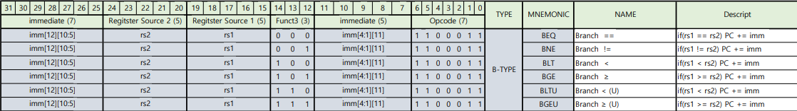
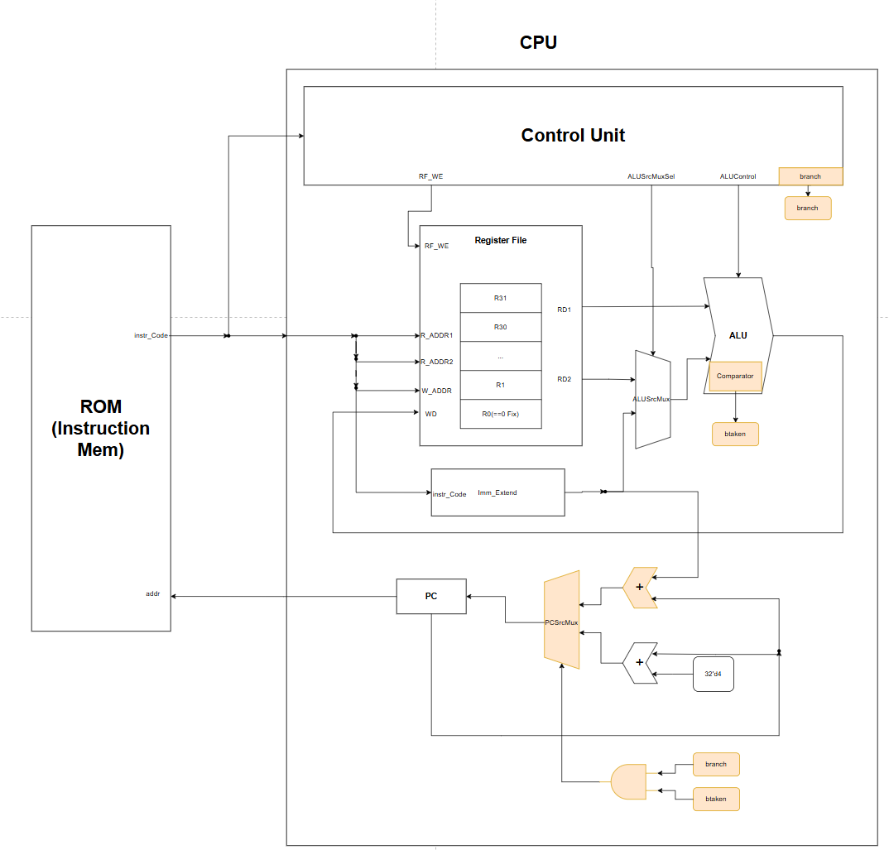
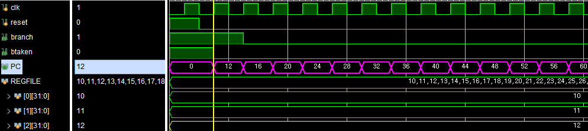
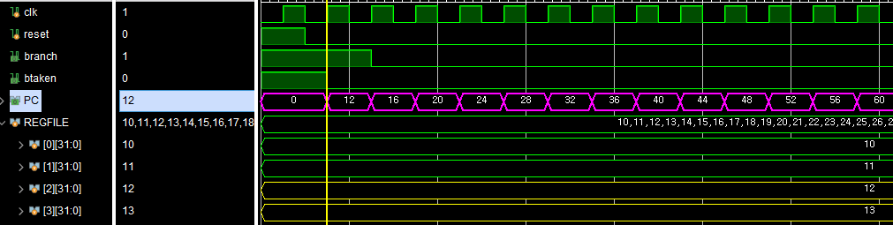
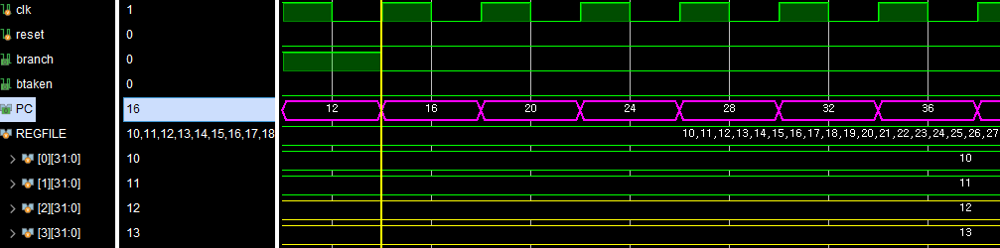
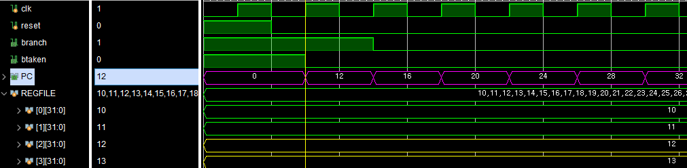
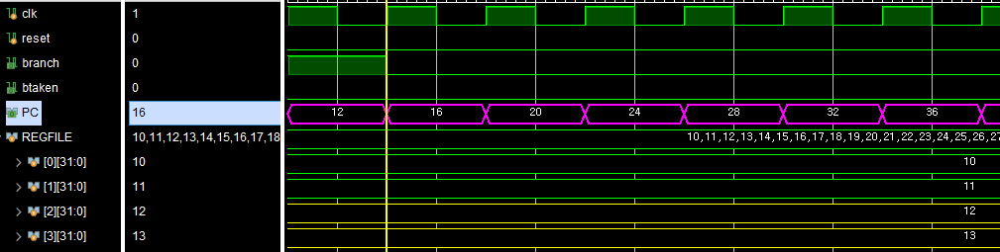
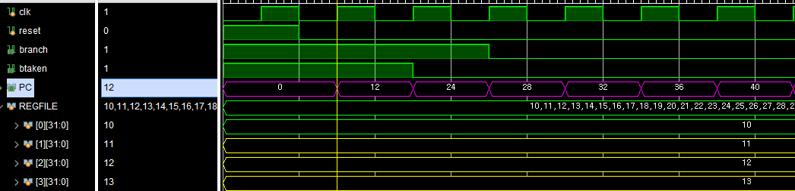
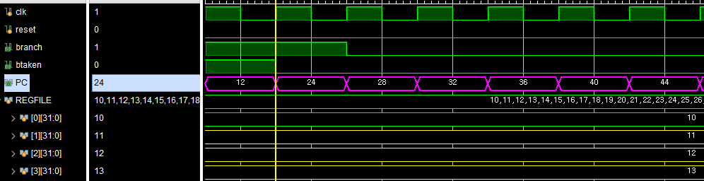
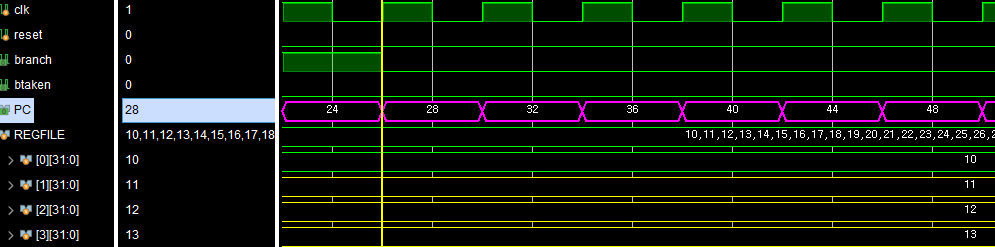

# RV32I-B Type

## ⚙️B-Type 역할

- **비교**를 통해 분기할 다음 명령어의 주소를 결정한다
- ⭐비교기와 PC 깂 연산이 핵심

|           **B-Type Base Instruction Code**            |
| :---------------------------------------------------: |
|  |


## 💻B-Type HW Architecture

|                **B-Type HW Architecture**                 |
| :-------------------------------------------------------: |
|  |

### Comparator in ALU

- Branch
  - **조건 비교**를 통한 분기
  - 비교 연산기 필요
- 산술 & 로직 연산을 하는 ALU에 해당 기능 추가
- 📶Signal: **btaken**
  - 조건비교의 결과(비교기 결과)에 따라 PC값이 바뀜
  - 비교기 결과를 알려주는 신호 필요

[Code Description]
```verilog
module alu(... , output logic btaken);

...

	always_comb begin : branch
        btaken = 1'b0;
        case (aluControl[2:0])
            `BEQ:  btaken = (a == b);
            `BNE:  btaken = (a != b);
            `BLT:  btaken = ($signed(a) < $signed(b));
            `BGE:  btaken = ($signed(a) >= $signed(b));
            `BLTU: btaken = (a < b);
            `BGEU: btaken = (a >= b);
        endcase
    end

...

endmodule
```

### Branch signal in Control Unit

- 현재 instruction type이 branch인지 알려주는 신호
  - B-Type과 R-Type의 func3부분이 겹침
  - B-Type이 아닐때도 ```btaken``` 신호가 출력됨
- PC의 값을 결정할때, ```btaken``` 신호만 가지고 결정하면 위험함
- branch 신호를 이용해서 PC의 값을 결정해줌

### PCSrcMux

- 조건 결과에 따라 다음 실행될 명령어의 주소(PC)가 달라짐
  - 조건 결과 False: 다음 PC의 값 == PC + 4
  - 조건 결과 True: 다음 PC의 값 == PC + imm
- Select Signal
  - branch 연산이고, 조건이 참(btaken == 1)일 때, PC+imm값이 다음 명령어의 주소가 됨
  - ```branch``` 와 ```btaken```을 &연산하여 Select Signal로 넣어줌

# 🔍Simulation 검증

> 분기문을 검증하는것이므로 ROM의 주소가 1씩 증가하는 것이 아닌 계속 바뀜
> > 그래서 ROM[x] 하나에 대해 B-Type 모든 연산을 검증함<br>
>> 조건의 참, 거짓 판별 구분을 쉽게 하기 위해 Register File의 초기값은 검증마다 바꿔주었음

## ⚙️RegisterFile Setting

```verilog
//////////////////////////////////TEST용
	initial begin  // for simulation test
        for (int i = 0; i < 32; i++) begin
            mem[i] = 10 + i;
        end
        mem[28] = 32'b1111_0000_0000_0000_0000_0000_0000_0000;
    end
/////////////////////////////////
```

## ⚙️ROM Setting

> BEQ에 대한 예시, 이런 식으로 참, 거짓 판별 진행 예정
```verilog
//////////////////////////////////TEST용
    //rom[x]=32'b imm7  _ rs2 _ rs1 _f3 _ imm5_ op // B-Type
    rom[0] = 32'b0000000_00010_00010_000_01100_1100011;// beq x2, x2, 12
    rom[3] = 32'b0000000_00010_00011_000_01100_1100011;// beq x2, x3, 12
//////////////////////////////////
```

## ✔️Simulation Verification

### BEQ

```verilog
//Machine Code
	  rom[0] = 32'b0000000_00010_00010_000_01100_1100011;// beq x2, x2, 12
    rom[3] = 32'b0000000_00010_00011_000_01100_1100011;// beq x2, x3, 12
```

|  BEQ   |                  True Case                  |                  False Case                  |
| :----: | :-----------------------------------------: | :------------------------------------------: |
| &nbsp; |  |  |

| CASE  | PC Value |
| :---: | :------: |
| True  |  32'd12  |
| False |  32'd16  |

- rom[0]에서는 결과가 참이므로, 현재 PC값에서 imm값(12)를 더한 값이 다음 PC값이 된다
- rom[3]에서는 결과가 거짓이므로, 현재 PC값에서 4를 더한 값이 다음 PC값이 된다
- ✅정상수행되는 것을 확인할 수 있다

### BNE

```verilog
//Machine Code
    rom[0] = 32'b0000000_00011_00010_001_01100_1100011;// bne x2, x3, 12
    rom[3] = 32'b0000000_00010_00010_001_01100_1100011;// bne x2, x2, 12
```

|  BNE   |                  True Case                  |                  False Case                  |
| :----: | :-----------------------------------------: | :------------------------------------------: |
| &nbsp; |  |  |

| CASE  | PC Value |
| :---: | :------: |
| True  |  32'd12  |
| False |  32'd16  |

- rom[0]에서는 결과가 참이므로, 현재 PC값에서 imm값(12)를 더한 값이 다음 PC값이 된다
- rom[3]에서는 결과가 거짓이므로, 현재 PC값에서 4를 더한 값이 다음 PC값이 된다
- ✅정상수행되는 것을 확인할 수 있다

### BLT

```verilog
//Machine Code
    rom[0] = 32'b0000000_00011_00010_100_01100_1100011;// blt x2, x3, 12
    rom[3] = 32'b0000000_00010_00010_100_01100_1100011;// blt x2, x2, 12
```

|  BLT   |                  True Case                  |                  False Case                  |
| :----: | :-----------------------------------------: | :------------------------------------------: |
| &nbsp; |  |  |

| CASE  | PC Value |
| :---: | :------: |
| True  |  32'd12  |
| False |  32'd16  |

- rom[0]에서는 결과가 참이므로, 현재 PC값에서 imm값(12)를 더한 값이 다음 PC값이 된다
- rom[3]에서는 결과가 거짓이므로, 현재 PC값에서 4를 더한 값이 다음 PC값이 된다
- ✅정상수행되는 것을 확인할 수 있다

### BGE

```verilog
//Machine Code
    rom[0] = 32'b0000000_00010_00011_101_01100_1100011;// bge x3, x2, 12
    rom[3] = 32'b0000000_00010_00010_101_01100_1100011;// bge x2, x2, 12
    rom[6] = 32'b0000000_00010_00001_101_01100_1100011;// bge x1, x2, 12
```

|          BGE           |               Simulation result               |
| :--------------------: | :-------------------------------------------: |
| **True Case**(rom[0])  |  |
| **True Case**(rom[3])  |  |
| **False Case**(rom[6]) |   |

| CASE  | PC Value |
| :---: | :------: |
| True  |  32'd12  |
| True  |  32'd24  |
| False |  32'd26  |

- rom[0]에서는 결과가 참이므로, 현재 PC값에서 imm값(12)를 더한 값이 다음 PC값이 된다
- rom[3]에서는 결과가 참이므로, 현재 PC값에서 imm값(12)를 더한 값이 다음 PC값이 된다
- rom[6]에서는 결과가 거짓이므로, 현재 PC값에서 4를 더한 값이 다음 PC값이 된다
- ✅정상수행되는 것을 확인할 수 있다