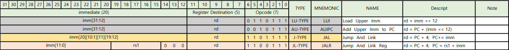
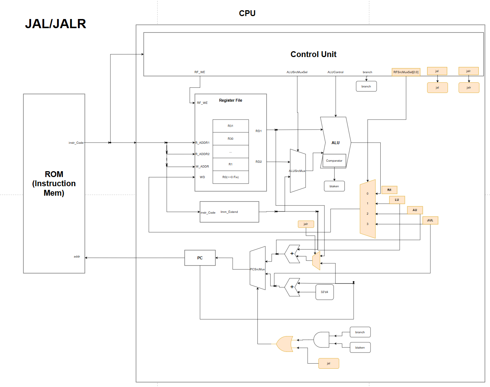
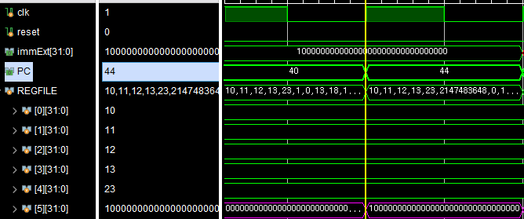
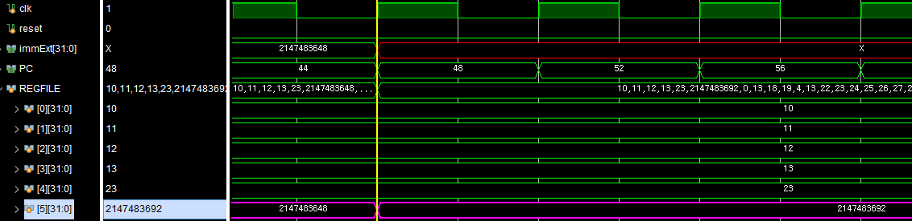
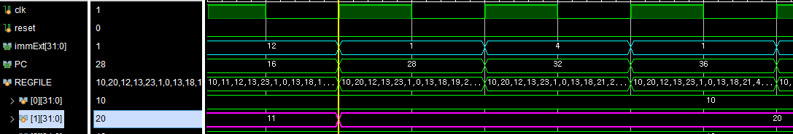
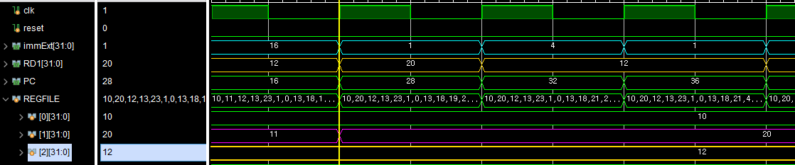

# RV32I-LU/AU_JAL/JALR Type

## ⚙️Type별 역할

| Type  |                                                 Description                                                  |
| :---: | :----------------------------------------------------------------------------------------------------------: |
|  LU   |                               큰 값을 만들때 사용<br>$imm*2^{12}$(== imm <<12)                               |
|  AU   |                             PC값 Offset이 굉장히 클 때 사용<br>$PC + imm*2^{12}$                             |
|   J   |                     Return Address를 저장하고, 분기 위치로 이동<br>PC 상대 주소 지정방식                     |
|  JL   | Return Address를 저장하고, 분기 위치로 이동<br>레지스터 간접주소 지정방식<br>(Return Address로 돌아갈 때 등) |

|                 **4-Type Base Instruction Code**                 |
| :--------------------------------------------------------------: |
|  |

## 💻LU/AU_JAL/JALR-Type HW Architecture

|   TYPE   | Block Diagram                                                         |
| :------: | :-------------------------------------------------------------------- |
| LUI/AUI  |     |
| JAL/JALR |  |

LUI/AUI
---

### RFSrcMux
- 각 타입에 따라 Register File에 Write되는 Data(rd)가 달라짐
  - LU: imm << 12
  - AU: PC + (imm << 12)
  - JAL/JALR: PC + 4
- 4input Mux 설계
- Instruction opcode에 따라 Mux Select signal 결정

### Imm_Extension
- LUI/AUI Type의 Immediate Value는 하위 12비트를 zero padding 시켜줘야함

[Code Description]
```verilog
module imm_extend(...);
	always_comb begin
	 case(opcode)
	 ...
		`OP_TYPE_LU:
            immExt = {
                instrCode[31:12], 12'b0
            };  //이거 자체가 shift해준거임
		`OP_TYPE_AU:
		immExt = {
			instrCode[31:12], 12'b0
		};  //이거 자체가 shift해준거임
	...
	 endcase
	end
endmodule
```

JAL/JALR
---

### PC_IMM_Adder_Src_Mux

- JALR의 경우 PC에 (rs1+imm)이 들어감
- Adder에서 PC와 더할 값중에 rs1과 imm중 선택 필요
  - 2:1 Mux 사용
- JALR Type일때만 rs1이 선택되니 Control Unit에서 ```jalr``` signal을 Mux select signal로 보내줌

### OR Gate for PCSrcMux
- JAL-Type일 때, B-Type과 마찬가지로 (PC+imm)값이 다음 PC값으로 들어감
- B-Type 조건일 때 **또는** JAL-Type 일때 PCSrcMux의 Select Signal이 1이 들어가야함
- Control Signal에서 ```opcode == JAL```일때 ```jal``` signal을 보내주고 이를 기존 branch AND Gate와 OR해주어 Select Signal로 보냄

# 🔍Simulation 검증

## ⚙️RegisterFile Setting

```verilog
//////////////////////////////////TEST용
    initial begin  // for simulation test
        for (int i = 0; i < 32; i++) begin
            mem[i] = 10 + i;
        end
    end
/////////////////////////////////
```

## ⚙️ROM Setting

```verilog
//////////////////////////////////TEST용
    //rom[x]=32'b imm20      _ rd  _ op // LU-Type
    rom[10] = 32'b00000000000000000001_00101_0110111;// lui x5, 0x10000
    //rom[x]=32'b imm20      _ rd  _ op // AU-Type
    rom[11] = 32'b00000000000000000001_00101_0010111;// auipc x5, 0x10000
	//rom[x]=32'b imm[20][10:1][11][19:12]      _ rd  _ op // J-Type
    // rom[4] = 32'b0_0000000110_0_00000000_00001_1101111;// jal x1, 12
    //rom[x]=32'b imm[11:0]_rs1 _000_ rd  _ op // JL-Type
    rom[4] = 32'b000000010000_00010_000_00001_1100111;// jalr x1, x2, 16
//////////////////////////////////
```

## ✔️Simulation Verification

### LUI

```verilog
//Machine Code
    //rom[x]=32'b imm20      _ rd  _ op // LU-Type
    rom[10] = 32'b10000000000000000000_00101_0110111;// lui x5, 0x10000
```

|  LUI   |                  Simulation Result                  |
| :----: | :-------------------------------------------------: |
| &nbsp; |  |

|  imm   |    32'h10000     |
| :----: | :--------------: |
| rd(x5) | 32'h10000**000** |

- ✅정상수행되는 것을 확인할 수 있다

### AUI

```verilog
//Machine Code
    //rom[x]=32'b imm20      _ rd  _ op // AU-Type
    rom[11] = 32'b10000000000000000000_00101_0010111;// auipc x5, 0x10000
```

|  AUI   |                  Simulation Result                  |
| :----: | :-------------------------------------------------: |
| &nbsp; |  |

| &nbsp; |     Value      |
| :----: | :------------: |
|  imm   | 32'd2147483648 |
|   PC   |     32'd44     |
| rd(x5) | 32'd2147483692 |

- ✅정상수행되는 것을 확인할 수 있다

### JAL

```verilog
//Machine Code
    //rom[x]=32'b imm[20][10:1][11][19:12]      _ rd  _ op // J-Type
    rom[4] = 32'b0_0000000110_0_00000000_00001_1101111;// jal x1, 12
```

|  JAL   |                  Simulation Result                  |
| :----: | :-------------------------------------------------: |
| &nbsp; |  |

|  &nbsp;  |     Value      |
| :------: | :------------: |
|   imm    |     32'd12     |
| PC_After |     32'd28     |
|  rd(X1)  | 32'd20(==16+4) |

- ✅정상수행되는 것을 확인할 수 있다

### JALR

```verilog
//Machine Code
    //rom[x]=32'b imm[11:0]_rs1 _000_ rd  _ op // JL-Type
    rom[4] = 32'b000000010000_00010_000_00001_1100111;// jalr x1, x2, 16
```

|  JALR  |                  Simulation Result                   |
| :----: | :--------------------------------------------------: |
| &nbsp; |  |

|  &nbsp;  |            Value             |
| :------: | :--------------------------: |
|   imm    |            32'd16            |
| PC_After | 32'd28(== RD1(12) + imm(16)) |
|  rd(X1)  |        32'd20(==16+4)        |

- ✅정상수행되는 것을 확인할 수 있다

