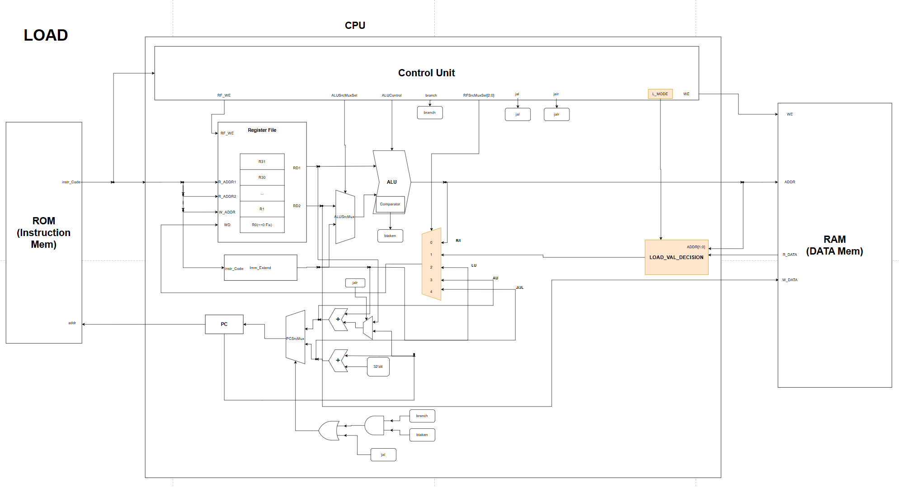
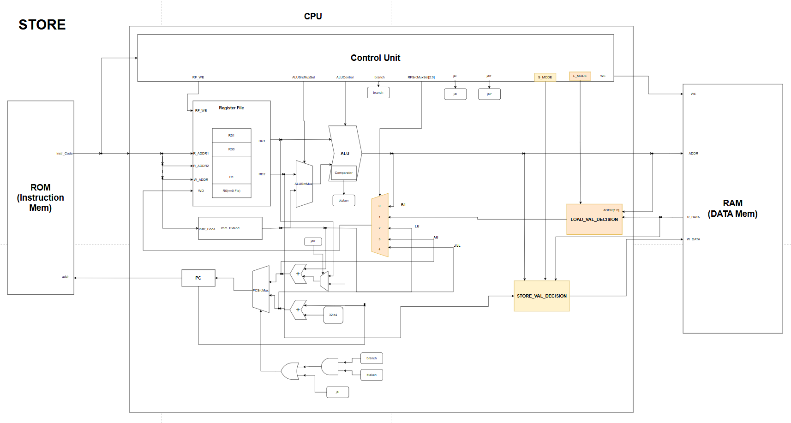
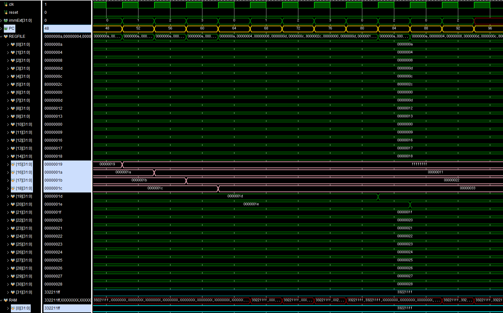
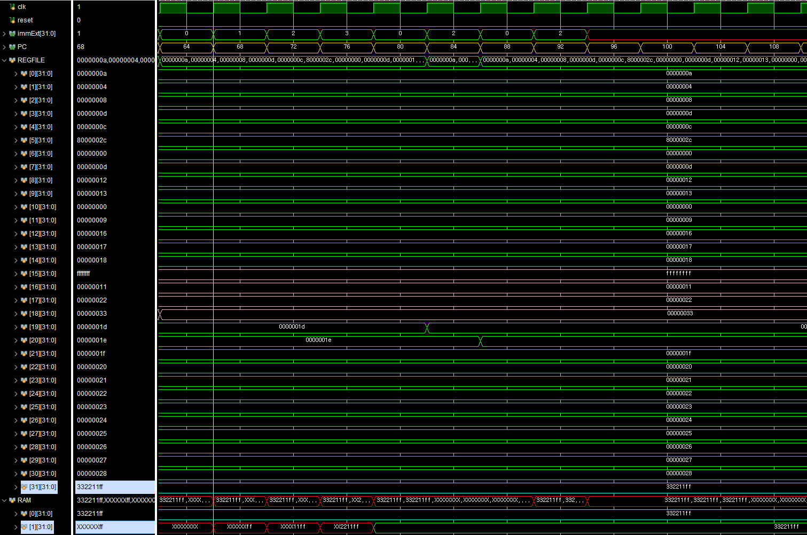
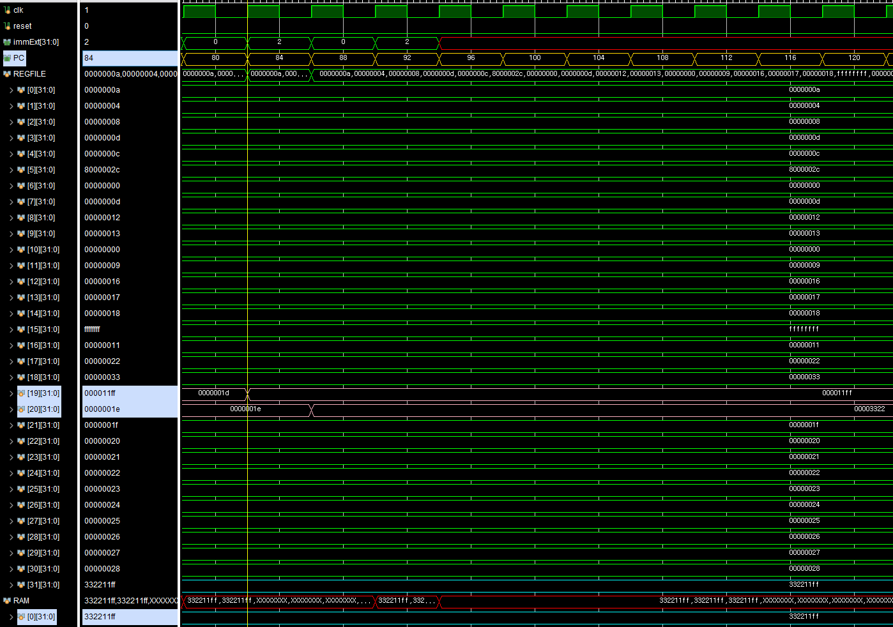
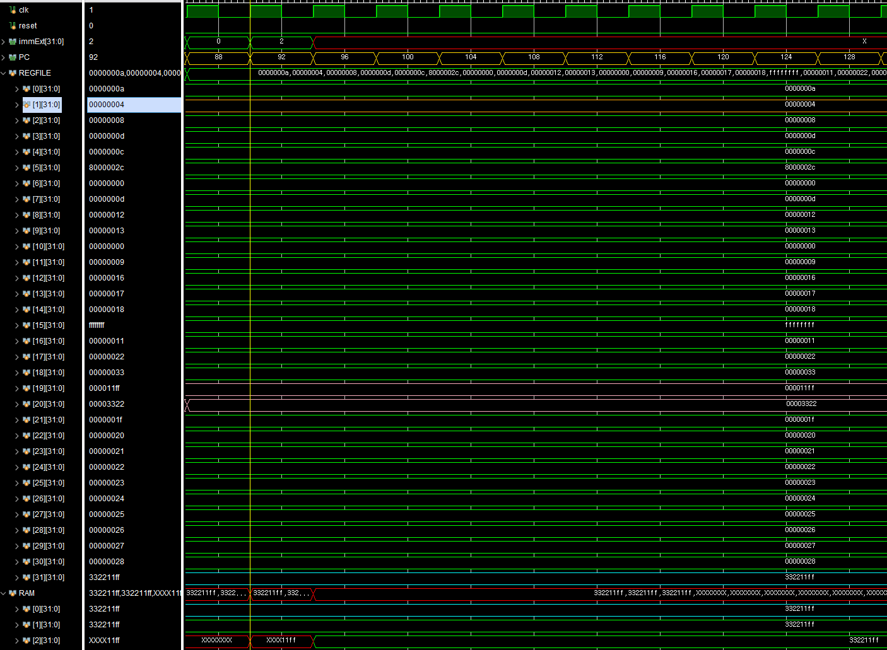
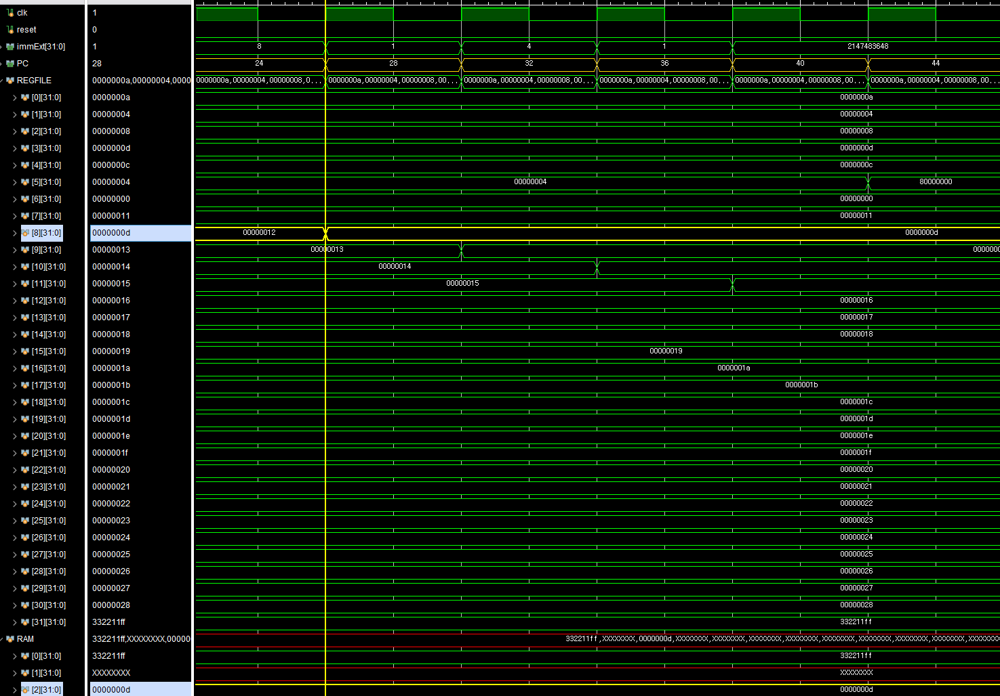
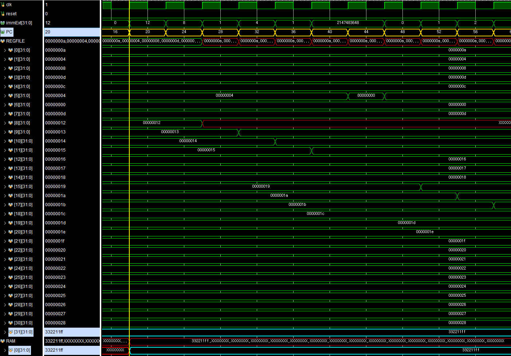

# RV32I-L/S Type

## ⚙️L/S-Type 역할

|  Type  |                    Description                     |
| :----: | :------------------------------------------------: |
| L-Type | Data Memory로부터 값을 읽어와 Register File에 저장 |
| S-Type |             Data Memory에 값을 저장함              |

> ⭐L/S Type의 연산을 수행하기 위해, Data Memory(**RAM**)이 추가로 필요하다

|    TYPE    |                       Block Diagram                       |
| :--------: | :-------------------------------------------------------: |
| **L-Type** |  |
| **S-Type** |  |

**L-Type**
---

### **Load_Value_Decision**

- Load Type에 따라 메모리에서 가져오는 데이터 사이즈가 다름
- ❗특히, Load Byte의 경우 바이트 단위로 주소를 접근하여 데이터를 가져오기 때문에 이를 고려해야함
  - RAM은 32bit Processor임을 가정하고 주소 접근시 2bit offset을 주었음
  - Byte 단위로 접근하기 위해 이제 주소의 하위 2비트값도 고려해야함
  - Control Unit에서 L_mode를 통해 Load할 데이터 사이즈(B, HW, W)를 알려줌
- **LB**
  - Byte 단위로 접근하기위해 addr[1:0] 하위 2비트에 따라 Load할 데이터 범위를 선택함
```verilog
case (addr[1:0])
	2'b00:
	load_value = {{{24{ram_read_data[7]}}}, ram_read_data[7:0]};
	2'b01:
	load_value = {
		{{24{ram_read_data[15]}}}, ram_read_data[15:8]
	};
	2'b10:
	load_value = {
		{{24{ram_read_data[23]}}}, ram_read_data[23:16]
	};
	2'b11:
	load_value = {
		{{24{ram_read_data[31]}}}, ram_read_data[31:24]
	};
endcase
```
- **LH**
  - Half World 단위로 접근하기 위해 addr[1]비트에 따라 Load할 데이터 범위를 선택함
    - ⚠️RAM 경계를 건드리는 것을 고려해야하는데, 이때, 항상 상위 16비트 혹은 하위 16비트만을 접근한다고 가정
```verilog
case (addr[1])
	1'b0:
	load_value = {
		{{16{ram_read_data[15]}}}, ram_read_data[15:0]
	};
	1'b1:
	load_value = {
		{{16{ram_read_data[31]}}}, ram_read_data[31:16]
	};
endcase
```
- **LW**
  - word의 경우, 들어오는 RAM_Read_Data를 그대로 내보낸다
```verilog
`LW: load_value = ram_read_data;
```
- **Unsigned**
  - Signed Case에서 확장할때, Zero Padding하는 것만 바꿔주면 된다

### **RFSrcMux**
- RAM에서 Read Data가 추가로 WD에 들어오는 Signal 중 하나가 됨
- 기존 4:1 Mux에서 5:1 Mux로 늘려야함

**S-Type**
---

### **Store_Value_Decision**

- Store Type에 따라 RAM에 저장할 데이터의 사이즈가 다름
- Load와 마찬가지로 Byte 단위 주소 접근을 위해서 address의 하위 2비트도 고려해줘야함
- Control Unit에서 **S_mode** 신호를 보내주어 RAM에 저장할 데이터의 범위를 알려줌
- ⭐RAM 수정을 배제하기 위해, RAM에 저장할 주소의 Data를 읽어서 DataPath에서 Store할 부분만 바꿔주어 RAM에 넣어주는 방식으로 설계함
- **SB**
  - Address의 하위 2비트를 보고, RAM에 저장할 32비트에서 store할 비트범위에 값만 바꿔주도록 설계
```verilog
store_value = 32'bz;
case (addr[1:0])
	2'b00:
	store_value = {ram_read_data[31:8], reg_file_data[7:0]};    
	2'b01:
	store_value = {
		ram_read_data[31:16],
		reg_file_data[15:8],
		ram_read_data[7:0]
	};
	2'b10:
	store_value = {
		ram_read_data[31:24],
		reg_file_data[23:16],
		ram_read_data[15:0]
	};
	2'b11:
	store_value = {reg_file_data[31:24], ram_read_data[23:0]};
endcase
```
- **SH**
  - addr[1]비트를 보고, RAM에 저장할 32비트에서 store할 비트 범위의 값만 바꿈
    - addr[1] == 1 : 상위 16비트
    - addr[1] == 0 : 하위 16비트
```verilog
case (addr[1])
	1'b0:
	store_value = {ram_read_data[31:16], reg_file_data[15:0]};
	1'b1:
	store_value = {reg_file_data[31:16], ram_read_data[15:0]};
endcase
```
- **SW**
  - Register File에서 읽은 32bit 그대로 RAM에 저장하면 됨
```verilog
`SW: store_value = reg_file_data;
```

# 🔍Simulation 검증

## ⚙️RegisterFile Setting

```verilog
//////////////////////////////////TEST용
    initial begin  // for simulation test
        for (int i = 0; i < 32; i++) begin
            mem[i] = 10 + i;
        end
		mem[31] = 32'h3322_11ff;
        mem[1] = 32'h0000_0004;
    end
/////////////////////////////////
```

## ⚙️ROM Setting

```verilog
	/*********** Byte ***********/
	//rom[x]=32'b imm12      _ rs1 _f3 _ rd  _ op // L-Type
    rom[12] = 32'b000000000000_00000_000_01111_0000011;// lb x15, 0(x0)
    rom[13] = 32'b000000000001_00000_000_10000_0000011;// lb x16, 1(x0)
    rom[14] = 32'b000000000010_00000_000_10001_0000011;// lb x17, 2(x0)
    rom[15] = 32'b000000000011_00000_000_10010_0000011;// lb x18, 3(x0)
    //rom[x]=32'b imm7  _ rs2 _ rs1 _f3 _ imm5_ op // S-Type
    rom[16] = 32'b0000000_11111_00001_000_00000_0100011;// sb x31, 0(x1)
    rom[17] = 32'b0000000_11111_00001_000_00001_0100011;// sb x31, 1(x1)
    rom[18] = 32'b0000000_11111_00001_000_00010_0100011;// sb x31, 2(x1)
    rom[19] = 32'b0000000_11111_00001_000_00011_0100011;// sb x31, 3(x1)
	
    /*********** Half Word ***********/
	//rom[x]=32'b imm12      _ rs1 _f3 _ rd  _ op // L-Type
    rom[20] = 32'b000000000000_00000_001_10011_0000011;// lh x19, 0(x0)
    rom[21] = 32'b000000000010_00000_001_10100_0000011;// lh x20, 2(x0)
    //rom[x]=32'b imm7  _ rs2 _ rs1 _f3 _ imm5_ op // S-Type
    rom[22] = 32'b0000000_11111_00001_001_00000_0100011;// sh x31, 0(x1)
    rom[23] = 32'b0000010_11111_00001_001_00001_0100011;// sh x31, 2(x1)

	/*********** Word ***********/
	//rom[x]=32'b imm12      _ rs1 _f3 _ rd  _ op // L-Type
    rom[6] = 32'b000000001000_00000_010_01000_0000011;// lw x8, 8(x0)
	//rom[x]=32'b imm7  _ rs2 _ rs1 _f3 _ imm5_ op // S-Type
    rom[4] = 32'b0000000_11111_00000_010_00000_0100011;// sw x31, 0(x0)
```

## ✔️Simulation Verification

### LB

```verilog
	/*********** Byte ***********/
	//rom[x]=32'b imm12      _ rs1 _f3 _ rd  _ op // L-Type
    rom[12] = 32'b000000000000_00000_000_01111_0000011;// lb x15, 0(x0)
    rom[13] = 32'b000000000001_00000_000_10000_0000011;// lb x16, 1(x0)
    rom[14] = 32'b000000000010_00000_000_10001_0000011;// lb x17, 2(x0)
    rom[15] = 32'b000000000011_00000_000_10010_0000011;// lb x18, 3(x0)
```

| Operate |              Simulation Result              |
| :-----: | :-----------------------------------------: |
| **LB**  |  |

|  PC   |  RAM(Load Data)   |        X15        |        X16        |        X17        |        X18        |
| :---: | :---------------: | :---------------: | :---------------: | :---------------: | :---------------: |
|  48   | 32'h3322_11**ff** | 32'hffff_ff**ff** |      &nbsp;       |      &nbsp;       |      &nbsp;       |
|  52   | 32'h3322_**11**ff |      &nbsp;       | 32'h0000_00**11** |      &nbsp;       |      &nbsp;       |
|  56   | 32'h33**22**_11ff |      &nbsp;       |      &nbsp;       | 32'h0000_00**22** |      &nbsp;       |
|  60   | 32'h**33**22_11ff |      &nbsp;       |      &nbsp;       |      &nbsp;       | 32'h0000_00**33** |

- 해당하는 주소(1Byte 단위)에 접근하여 값을 정상적으로 Register File에 가져오는 것을 확인 가능
- ✅정상수행되는 것을 확인할 수 있다

### SB

```verilog
	/*********** Byte ***********/
	//rom[x]=32'b imm7  _ rs2 _ rs1 _f3 _ imm5_ op // S-Type
    rom[16] = 32'b0000000_11111_00001_000_00000_0100011;// sb x31, 0(x1)
    rom[17] = 32'b0000000_11111_00001_000_00001_0100011;// sb x31, 1(x1)
    rom[18] = 32'b0000000_11111_00001_000_00010_0100011;// sb x31, 2(x1)
    rom[19] = 32'b0000000_11111_00001_000_00011_0100011;// sb x31, 3(x1)
```

| Operate |              Simulation Result              |
| :-----: | :-----------------------------------------: |
| **SB**  |  |

|      X31      |   RAM_0번지   |   RAM_1번지   |   RAM_2번지   |   RAM_3번지   |
| :-----------: | :-----------: | :-----------: | :-----------: | :-----------: |
| 32'b3322_11ff | 32'bXXXX_XXff | 32'bXXXX_11ff | 32'bXX22_11ff | 32'b3322_11ff |

- RAM의 0번지부터 3번지까지 Byte단위로 값이 저장되는 것을 확인 가능
- ✅정상수행되는 것을 확인할 수 있다

### LH

```verilog
	/*********** Half Word ***********/
	//rom[x]=32'b imm12      _ rs1 _f3 _ rd  _ op // L-Type
    rom[20] = 32'b000000000000_00000_001_10011_0000011;// lh x19, 0(x0)
    rom[21] = 32'b000000000010_00000_001_10100_0000011;// lh x20, 2(x0)
```

| Operate |              Simulation Result              |
| :-----: | :-----------------------------------------: |
| **LH**  |  |

|    RAM[0]     |        X19        |        X20        |
| :-----------: | :---------------: | :---------------: |
| 32'h3322_11ff | 32'h0000_**11ff** | 32'h0000_**3322** |

- RAM[0]의 32비트 데이터에서 상위 16비트, 하위 16비트가 레지스터 파일로 정상적으로 Load되는 것을 확인할 수 있다
- ✅정상수행되는 것을 확인할 수 있다

### SH

```verilog
	/*********** Half Word ***********/
	//rom[x]=32'b imm7  _ rs2 _ rs1 _f3 _ imm5_ op // S-Type
    rom[22] = 32'b0000000_11111_00001_001_00000_0100011;// sh x31, 0(x1)
    rom[23] = 32'b0000010_11111_00001_001_00001_0100011;// sh x31, 2(x1)
```

| Operate |              Simulation Result              |
| :-----: | :-----------------------------------------: |
| **SH**  |  |

|      X31      |   RAM[2][15:0]    |   RAM[2][31:16]   |
| :-----------: | :---------------: | :---------------: |
| 32'h3322_11ff | 32'hXXXX_**11ff** | 32'h3322_**11ff** |

- Register File에서 나온 저장할 Data가 RAM[2](실주소 4번지)에 각각 하위 16비트, 상위 16비트에 순차적으로 저장되는 것을 확인할 수 있다
- ✅정상수행되는 것을 확인할 수 있다

### LW

```verilog
	/*********** Word ***********/
	//rom[x]=32'b imm12      _ rs1 _f3 _ rd  _ op // L-Type
    rom[6] = 32'b000000001000_00000_010_01000_0000011;// lw x8, 8(x0)
```

| Operate |              Simulation Result              |
| :-----: | :-----------------------------------------: |
| **LW**  |  |

|    RAM[2]     |      X8       |
| :-----------: | :-----------: |
| 32'h0000_000d | 32'h0000_000d |

- RAM[2]의 Data가 Register File(X8)에 정상적으로 load되는 것을 확인할 수 있다
- ✅정상수행되는 것을 확인할 수 있다

### SW

```verilog
	/*********** Word ***********/
	//rom[x]=32'b imm7  _ rs2 _ rs1 _f3 _ imm5_ op // S-Type
    rom[4] = 32'b0000000_11111_00000_010_00000_0100011;// sw x31, 0(x0)
```

| Operate |              Simulation Result              |
| :-----: | :-----------------------------------------: |
| **SW**  |  |

|      X31      |    RAM[0]     |
| :-----------: | :-----------: |
| 32'h3322_11ff | 32'h3322_11ff |

- Register File(X31)의 데이터가 RAM[0]에 정상적으로 Store되는 것을 확인할 수 있다
- ✅정상수행되는 것을 확인할 수 있다

