# 🚲RV32I - Multi Cycle

## 🧐Multi-Cycle 왜 쓸까

### 🐢Single-Cycle

|                         Single-Cycle Path                         |
| :---------------------------------------------------------------: |
| 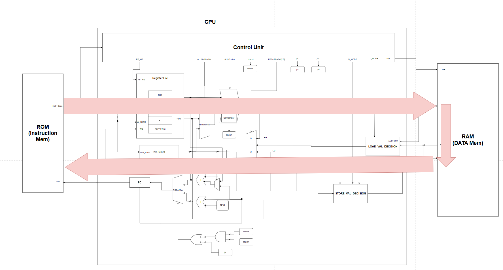 |

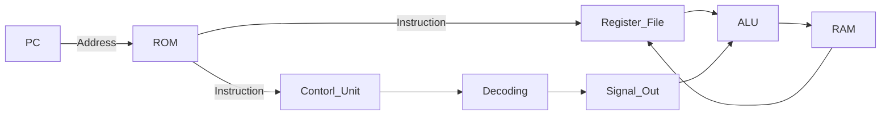

- Single-Cycle의 경우 1clk안에 명령을 처리해야함
- Combinational Logic Path가 **매우 긺**⚠️
- ⭐**Critical Path**에서 걸리는 시간이 곧 Clk Frequncy를 결정함
- **속도가 느리다**

### 🐇Multi-Cycle

|                    Multi-Cycle Stages                     |
| :-------------------------------------------------------: |
| 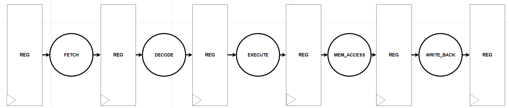 |

|      Step      |                          Description                          |
| :------------: | :-----------------------------------------------------------: |
|   **Fetch**    |          **PC** => **ROM**<br>수행할 명령어를 가져옴          |
|   **Decode**   |                **Control Unit**<br>명령어 해석                |
|  **Execute**   |      **Data Path**<br>해석된 명령어를 바탕으로 연산 수행      |
| **Mem_Access** |              **RAM**<br>RAM에 접근(load/ store)               |
| **Write_back** | **RAM**<br>RAM으로 가져온 데이터를 Register File에 저장(load) |

- 명령어 연산 수행을 단계별로 나눔
- 각 Stage사이에 Pipe register 존재
  - Combinational Logic Path 줄어듦
  - Clk Frequeny를 높일 수 있다
- 명령 Type마다 Step의 수가 다름
  - ex) R, I Type은 Execute까지, L Type은 WB까지 수행
  - 명령 타입별 소모 클럭 수를 달리할 수 있음
  - 클럭을 효율적으로 관리 가능

🆚Single-Cycle Vs Multi-Cycle
---
|     &nbsp;     | Single-Cycle |    Multi-Cycle    |
| :------------: | :----------: | :---------------: |
|   **Speed**    |     Slow     | Fast(than Single) |
| **Complexity** |     Easy     |       Hard        |

# 🎨HW Design

## Stage별 연산 정리

|      &nbsp;       |                               Image                               |
| :---------------: | :---------------------------------------------------------------: |
|  **Description**  |     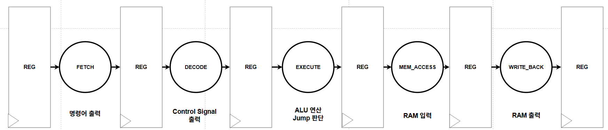     |
| **Block Diagram** | 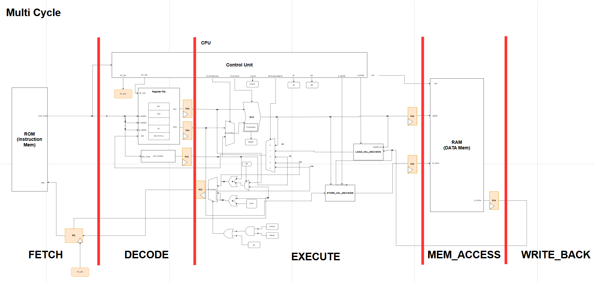 |

- 각 Stage에 해당하는 HW 구간을 나눔
- 다음 Stage로 넘어가기 전, Register를 거쳐서 나감
  - 이전 Stage가 끝나기전까지 대기 필요
  - Register로 조절

☸️FETCH
---

### PC
- 기존에 1Clk마다 명령어 처리
- Multi-Cycle에서는 명령어 타입별로 소모 클럭 수가 다름
  - ❗매 클럭마다 PC를 업데이트해주면 안됨
  - PC_En 신호로 조절

🗝️Decode
---
- **Control Unit**에서 Instruction Code를 해석하여 제어신호 출력
- Register File의 출력은 Decode Stage에서 대기 필요
  - Reegister를 두어 1clk 늦춤

🧮Execute
---
- **ALU** 및 연산 로직에서 Control Unit에서 받은 제어신호를 토대로 연산 수행 시작
- 다음 Stage인 RAM에 접근하기 전에, 1Clk 대기 필요
  - Pipe Register를 둠

📂Memory Access
---
- RAM에 접근하여, Register File에서의 Data를 저장함
- Read Data의 경우 Write Back이 수행되기 전까지 대기 필요
  - Register를 두어 1Clk 대기

✍️Write Back
---
- RAM에서 읽어온 Data(Read Data)를 Register File에 저장함

# 🔍Simulation 검증

## ✔️Simulation Verification
> 모든 Case를 검증하였으나, 기록은 특수 Case에 대해서만 하였다

## 1. R-Type

### SRA & SRL

|                   Simulation Result                    |
| :----------------------------------------------------: |
| 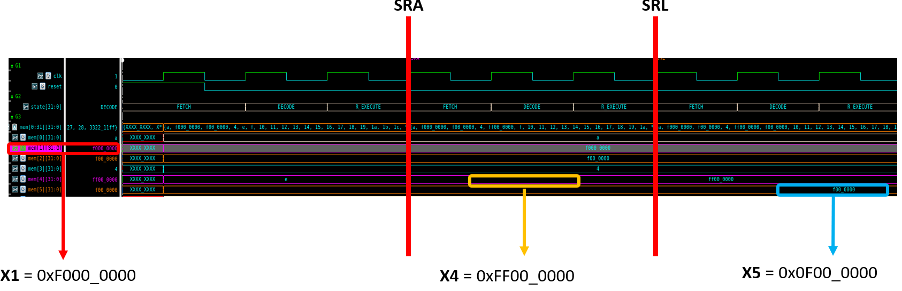 |

|    &nbsp;    | Test_Vector | Shift_Value |     SRA     |     SRL     |
| :----------: | :---------: | :---------: | :---------: | :---------: |
| **Register** |     X1      |     X3      |     X4      |     X5      |
|  **Value**   | 0xF000_0000 |     0x4     | 0xFF00_0000 | 0x0F00_0000 |

### SLT & SLTU

|                    Simulation Result                    |
| :-----------------------------------------------------: |
| 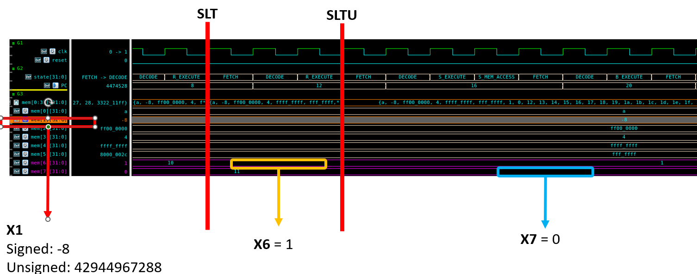 |

|    &nbsp;    |             Test_Vector             | 비교 대상 |  SLT  | SLTU  |
| :----------: | :---------------------------------: | :-------: | :---: | :---: |
| **Register** |                 X1                  |    X0     |  X6   |  PC   |
|  **Value**   | Signed: -8<br>Unsigned: 42944967288 |    0x0    |  0x1  |  0x0  |


## 2. I-Type

### SRAI & SRLI

|                 Simulation Result                  |
| :------------------------------------------------: |
| 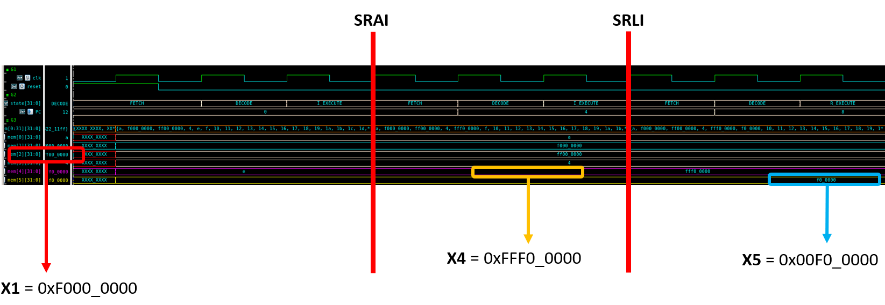 |

|    &nbsp;    | Test_Vector | Immediate Value |    SRAI     |    SRLI     |
| :----------: | :---------: | :-------------: | :---------: | :---------: |
| **Register** |     X1      |       Imm       |     X6      |     X7      |
|  **Value**   | 0xF000_0000 |       0x8       | 0xFFF0_0000 | 0x00F0_0000 |

## 3. B-Type

|                Simulation Result                 |
| :----------------------------------------------: |
| 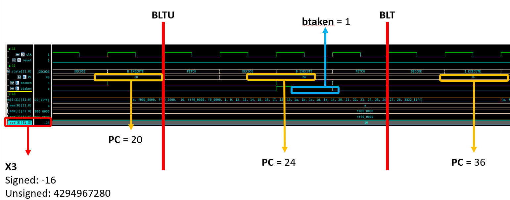 |

|    &nbsp;    |             Test_Vector             | 비교값 | Immediate Value |  초기 PC   | BLTU  |  BLT  |
| :----------: | :---------------------------------: | :----: | :-------------: | :--------: | :---: | :---: |
| **Register** |                 X1                  |   X0   |       Imm       | Initial PC |  PC   |  PC   |
|  **Value**   | Signed: -16<br>Unsigned: 4294967280 |  0x0   |       12        |     20     |  24   |  36   |

## 4. LU/AU-Type

|                 Simulation Result                  |
| :------------------------------------------------: |
| 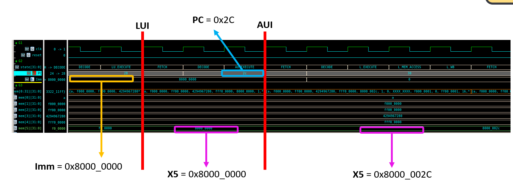 |

|    &nbsp;    | Immediate Value |  LUI  | Befor AU PC |     AUI     |
| :----------: | :-------------: | :---: | :---------: | :---------: |
| **Register** |       Imm       |  X5   |     PC      |     X5      |
|  **Value**   |    0x1000_0     | 0x2C  | 0x8000_0000 | 0x8000_002C |

## 5. J/JL-Type

|                 Simulation Result                 |
| :-----------------------------------------------: |
|  |

|      &nbsp;      | Retrun Address |   PC   |
| :--------------: | :------------: | :----: |
|   **Register**   |     **X1**     | **PC** |
| **J_Before_PC**  |       XX       |   16   |
|  **J_After_PC**  |       20       |   28   |
| **JL_Before_PC** |       20       |   28   |
| **JL_After_PC**  |       32       |   16   |

## 6. L/S Type

### SW/LW

|                 Simulation Result                  |
| :------------------------------------------------: |
| 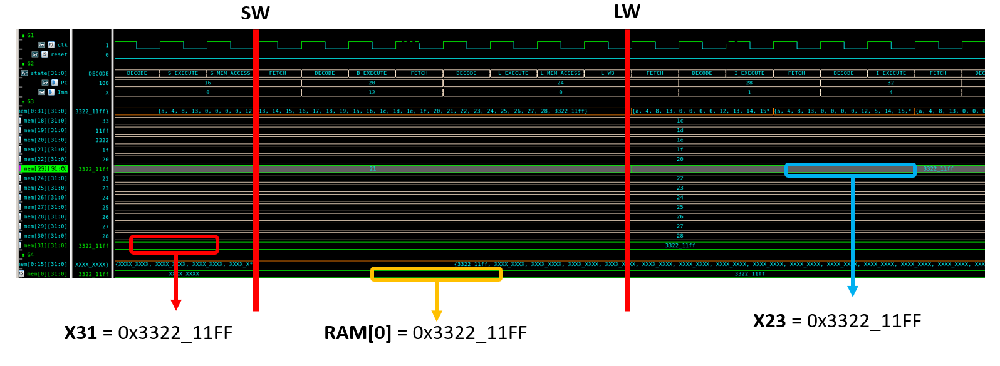 |

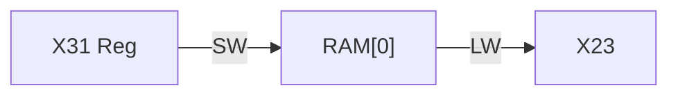

### LB

|                Simulation Result                |
| :---------------------------------------------: |
| 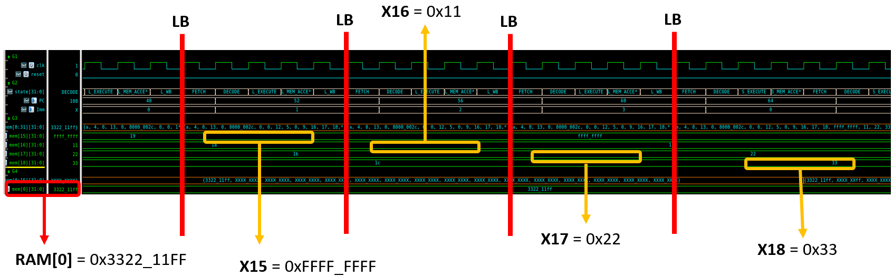 |

|   &nbsp;   |             Data              |
| :--------: | :---------------------------: |
| **RAM[0]** |          0x3322_11FF          |
|  **X15**   | 0xFFFF_FFFF<br>Sign Extension |
|  **X16**   |             0x11              |
|  **X17**   |             0x22              |
|  **X18**   |             0x33              |

### SB

|                Simulation Result                |
| :---------------------------------------------: |
| 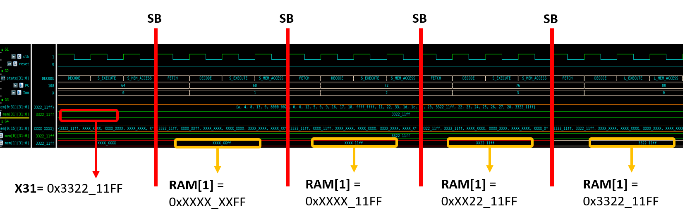 |

|      &nbsp;       |    Data     |
| :---------------: | :---------: |
|      **X31**      | 0x3322_11FF |
| **RAM[0]:1st SB** | 0xXXXX_XXFF |
| **RAM[0]:2nd SB** | 0xXXXX_11FF |
| **RAM[0]:3rd SB** | 0xXX22_11FF |
| **RAM[0]:4th SB** | 0x3322_11FF |

### LH

|                Simulation Result                |
| :---------------------------------------------: |
| 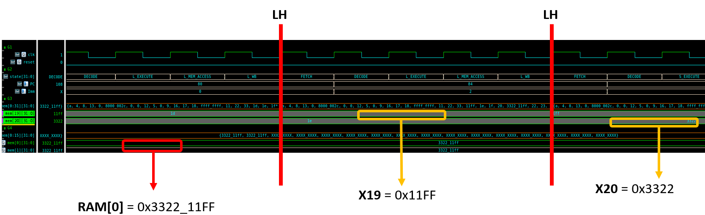 |

|   &nbsp;   |    Data     |
| :--------: | :---------: |
|  **X31**   | 0x3322_11FF |
| **RAM[0]** | 0x3322_11FF |
|  **X19**   |   0x11FF    |
|  **X20**   |   0x3322    |

### SH

|                Simulation Result                |
| :---------------------------------------------: |
| 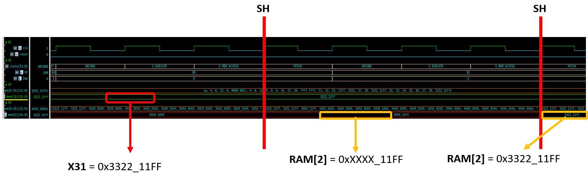 |

|       &nbsp;       |    Data     |
| :----------------: | :---------: |
|      **X31**       | 0x3322_11FF |
| **RAM[2]: 1st SH** | 0xXXXX_11FF |
| **RAM[2]: 2nd SH** | 0x3322_11FF |

# 🚀Trouble Shooting

## 1️⃣Store Value Decision Module
- Store Value Decision은 RAM에 쓸 주소의 데이터를 미리 읽어와서 저장할 데이터 부분을 교체함
- Multy-Cycle의 경우
  - S_Execute에서 Store할 데이터를 교체하는 작업을 수행함
  - 이 때, Execute단계에서 ```ALU```에서 연산된 주소의 RAM 데이터를 읽어와야함
  - ❗그러나 Multi-Cycle로 바꾸면서 RAM address 입력부에 Register를 둠
  - ⭐Execute단계에서 연산된 주소의 Data를 읽어와야하지만 Register로 인해 이전 주소의 데이터를 읽어옴
    - 엉뚱한 주소의 데이터를 읽어오는 문제점
- RAM 데이터 바로 읽어서 해결(레지스터 출력을 읽어오지 않음)

## 2️⃣Memory Multiple Driving Problem(Register File)

### Vivado에서 코드
```verilog
    initial begin  // for simulation test
        for (int i = 0; i < 32; i++) begin
            mem[i] = 10 + i;
        end
        mem[31] = 32'h3322_11ff;
        mem[1]  = 32'h0000_0004;
        mem[2]  = 32'h0000_0008;
    end

    always_ff @(posedge clk) begin
        if (we) mem[WA] <= WD;
    end
```
- 기존 Vivado에서 Simulation을 위해 Register File의 일부 주소에 데이터를 ```initial```을 이용해 넣어줌
- Vivado에서는 ```always``` block과 ```initial``` block에서 동시에 Memory에 write를 해도 문제X
- **VCS Verdi**
  - Multiple Drive Error 발생❗
  - Coder는 ```always```와 ```initial```에서 동시에 memory의 동일 주소에 접근하지 않는다는 것을 앎
  - **Compiler** 입장에서는 이 사실을 알지 못함
  - 그래서 initial에서 초기값을 주지않고, always 문안에 ```reset```이 들어올 때, 초기값을 세팅해줌

### 수정 후 코드(in VCS Verdi)
```verilog
    always_ff @(posedge clk) begin
        if(test_reset) begin
            for (int i = 0; i < 32; i++) begin
            mem[i] = 10 + i;
        end
        mem[31] = 32'h3322_11ff;
        mem[1]  = 32'h0000_0004;
        mem[2]  = 32'h0000_0008;
        end
        else if (we) mem[WA] <= WD;
    end
```