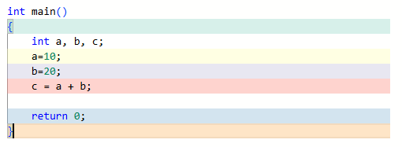
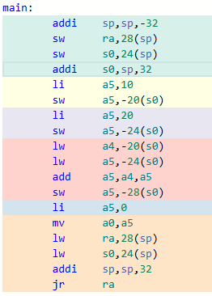

# RV32 Machine Code 분석

|                       C code                       |                       Assembly                       |
| :------------------------------------------------: | :--------------------------------------------------: |
|  |  |

- sp: stack pointer
  - stack의 위치(주소)를 알려주는 레지스터
- ra: return address
  - 돌아올 주소를 저장하는 레지스터

## C언어 메모리 구조

|  &nbsp;   |        **Memory**         |
| :-------: | :-----------------------: |
| **stack** |  stack area: 함수, 변수   |
| **heap**  |  heap area: 동적 메모리   |
| .**bss**  | 초기화 안된 전역변수 영역 |
| .**data** |  초기화된 전역변수 영역   |
| .**text** |         code 영역         |

- Stack
  - RAM의 마지막 주소 + 1
  - stack pointer
    - stack이 현재 가리키는 주소